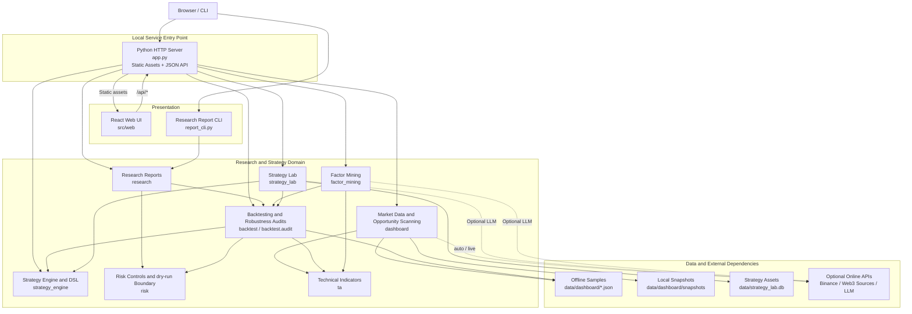

# web3-quant-sandbox

[中文](README.md) | [English](README.en.md)

An offline-first Web3 quantitative research sandbox. It brings market dashboards, opportunity radar, factor mining, data-source monitoring, strategy backtests, risk audits, a simulated trading workstation, strategy DSL checks, and research reports into one local application for learning, teaching, strategy prototyping, and Codex delivery-course demos.

By default, the project runs from bundled samples and repository snapshots. It does not connect to real trading accounts, manage wallets, or place real orders.

> If this project helps you learn Web3 quant research, backtesting engineering, or the Codex course workflow, please consider starring it. If you want to customize strategies, connect data sources, or build your own research panel, fork it and extend it freely.

## Highlights

- **Offline-first**: bundled `data/dashboard/*.json` samples let the core pages run without network access.
- **Public learning academy**: `/academy` combines foundational math, backtesting, K-line, diagnostic analysis, asset-management, and risk-control courses, with risk controls spanning selection, diagnosis, trade validation, and portfolio management.
- **Complete research loop**: market overview, opportunity scanning, factor mining, data-source status, strategy backtests, risk review, simulated execution, and research reports.
- **Simulated trading workstation**: `/live-trading` includes a K-line canvas, timeframe switching, trade-plan overlays, dry-run tickets, and evidence panels.
- **Clear safety boundary**: dry-run only records research actions; the project does not submit real exchange orders by default.
- **Extensible strategies and indicators**: examples include MA, MACD, BOLL, RSI, funding-rate strategies, factor mining, and rolling backtests.
- **Course-aligned workspace**: chapters in `docs/v2/` are expected to match runnable commands and code.
- **Full-stack app**: Python local service + React / Ant Design / lightweight-charts frontend.

## Preview


## Code Architecture

The project uses an integrated local full-stack architecture. `app.py` serves both the built React application and the JSON API, routing requests to the market-research, backtest-audit, factor-mining, and strategy-lab domain modules. By default, data flows read bundled offline samples or local snapshots first; online sources are accessed only when `auto` or `live` mode is explicitly enabled.



All online dependencies in the diagram are optional. Strategy execution remains within the simulated, read-only research boundary and never submits real exchange orders.

## Quick Start

### Requirements

- Python 3.11+
- Node.js 18+
- npm

### Windows PowerShell

```powershell
py scripts/course.py setup
py app.py
```

If the `py` launcher is not available, use:

```powershell
python scripts/course.py setup
python app.py
```

Then open:

```text
http://127.0.0.1:8765
```

Common pages:

| Page | URL |
| --- | --- |
| Market dashboard | `http://127.0.0.1:8765/trading` |
| Opportunity radar | `http://127.0.0.1:8765/radar` |
| Factor mining | `http://127.0.0.1:8765/factor-mining` |
| Data source monitor | `http://127.0.0.1:8765/data-sources` |
| Strategy backtests | `http://127.0.0.1:8765/backtests` |
| Simulated trading workstation | `http://127.0.0.1:8765/live-trading` |
| Risk center | `http://127.0.0.1:8765/risk` |
| Strategy DSL | `http://127.0.0.1:8765/strategy` |
| Market research | `http://127.0.0.1:8765/research` |

### macOS / Linux

```bash
make setup
python app.py
```

## Core Features

| Feature | Web route | Main code paths | Notes |
| --- | --- | --- | --- |
| Market dashboard | `/trading` | `src/dashboard/`, `src/web/src/pages/trading/DashboardPage.tsx` | Multi-asset quotes, K-line charts, trading signals, risk summaries, and execution entry points |
| Public learning academy | `/academy`, `/math-learning`, `/backtest-learning`, `/kline-learning`, `/risk-learning` | `src/web/src/pages/learning/` | Quantitative math, backtesting, K-line, diagnostic analysis, asset-management, and risk-control courses; math, K-line, backtesting, and risk include 169 formulas, 43 chapter guides, search, progress, exercises, pitfalls, and authoritative references, with interactive labs retained for K-line, backtesting, and risk |
| Opportunity radar | `/radar` | `src/dashboard/opportunity.py`, `src/web/src/pages/trading/RadarPage.tsx` | Scans opportunities with fund flow, trend, on-chain, and risk signals; labels hot paths, cold paths, and blocked paths |
| Factor mining | `/factor-mining` | `src/factor_mining/`, `src/web/src/pages/trading/FactorMiningPage.tsx` | GP/ML/template/LLM candidate generation and IC/RIC validation; hands off via `backtest_spec` to strategy backtests |
| Data source monitor | `/data-sources` | `src/dashboard/snapshot.py`, `src/dashboard/catalog.py` | Shows offline samples, online snapshots, API status, and research-draft gates |
| Strategy backtests | `/backtests` | `src/backtest/`, `src/backtest/rolling/` | Single strategy tests, window comparison, walk-forward, portfolio, and robustness checks; consumes handed-off mined factors |
| Simulated trading workstation | `/live-trading` | `src/web/src/pages/trading/LiveTradingPage.tsx`, `src/risk/`, `src/strategy_engine/` | Sample-data-driven dry-run execution UI, not a live trading terminal |
| Risk center | `/risk` | `src/risk/`, `src/backtest/audit/` | Drawdown, stop loss, rejection logs, CPCV, PBO, DSR, and other risk views |
| Strategy DSL | `/strategy` | `src/strategy_engine/dsl/` | AST allowlist, import restrictions, look-ahead checks, and compile validation |
| Market research | `/research` | `src/research/`, `src/dashboard/llm_signal.py` | Research summaries, source cards, and optional LLM signal analysis |
| CLI report | None | `report_cli.py`, `src/research/report.py` | Outputs summary or JSON research reports |

## Simulated Trading Workstation

`/live-trading` is the simulated execution entry point for the research workflow. It is not a live trading terminal. The page is organized like a trading workstation:

- **Left intelligence rail**: current pair, reference price, signal conclusion, confidence, risk status, and AI Picks queue.
- **Central K-line canvas**: lightweight-charts candlesticks, volume, MA20, MA60, plus signal-derived entry, stop, and target lines.
- **Timeframe switching**: supports `15m / 1h / 4h / 1D` K-line intervals.
- **Right dry-run ticket**: pair, side, venue, amount, slippage tolerance, latency, and confirmation text; it only creates simulated audit records.
- **Evidence panels**: segmented views for market, signal, risk, ledger, and system assumptions.
- **Light and dark themes**: light mode favors research dashboards; dark mode keeps the trading-terminal feel.

## Data Modes

Dashboard data comes from three source types:

1. `data/dashboard/*.json`: bundled offline samples that work without network access.
2. `data/dashboard/snapshots/`: snapshots captured from online sources.
3. Online APIs: used only when API keys are configured and `DASHBOARD_DATA_MODE=auto` or `DASHBOARD_DATA_MODE=live` is enabled.

Common data commands:

| Command | Purpose |
| --- | --- |
| `py scripts/course.py snapshot` | Fetch dashboard data online and write snapshots |
| `py scripts/course.py sync-fixtures` | Sync full snapshots into bundled samples |
| `py scripts/course.py save-offline-data` | Fetch snapshots and sync offline samples |
| `py scripts/course.py build-fixtures` | Fill samples from snapshots or seed data |

Copy `.env.example` to `.env` if you need local configuration. Without API keys, the app still starts with offline samples.

## CLI Reports

```powershell
python report_cli.py --format summary
python report_cli.py --format json --short 3 --long 7
```

Reports are assembled by `src/research/report.py` from sample data, backtest metrics, risk checks, and execution-boundary notes.

## Frontend Development

In production mode, `app.py` serves `src/web/static/` directly. For frontend development, run Vite alongside the local backend:

```powershell
py app.py
cd src/web
npm run dev
```

Build the frontend separately:

```powershell
cd src/web
npm run build
```

## Verification

During edits, run:

```powershell
py scripts/course.py verify
```

If the `py` launcher is unavailable in the current Windows environment, use the repository virtual environment:

```powershell
.\.venv\Scripts\python.exe scripts\course.py verify
```

Before finishing repository-wide changes, run:

```powershell
py scripts/course.py check
```

`check` also runs the implementation matrix, asset audit, and courseware check. Every check depends only on files in the public repository. After editing plot scripts, regenerate teaching figures:

```powershell
py scripts/course.py teaching-plots
```

## Project Structure

```text
.
|-- app.py                     # Local HTTP server, default 127.0.0.1:8765
|-- report_cli.py              # CLI research report
|-- verify.py                  # Product verification entry point
|-- scripts/
|   `-- course.py              # setup / verify / check / snapshot tasks
|-- src/
|   |-- backtest/              # Backtests, rolling windows, audit metrics
|   |-- config/                # Environment variables and upstream configuration
|   |-- dashboard/             # Market data, snapshots, opportunity scan, API adapters
|   |-- data/                  # Point-in-time data utilities
|   |-- factor_mining/         # Factor mining and factor backtests
|   |-- research/              # Research report assembly
|   |-- risk/                  # Risk rules and simulation boundaries
|   |-- strategy_engine/       # Event-driven strategy engine and DSL
|   |-- ta/                    # Technical indicator utilities
|   `-- web/                   # React + Ant Design frontend
|-- data/                      # Offline samples and dashboard snapshots
|-- docs/v2/                   # Course chapters
|-- skills/                    # Codex skills developed in the course
|-- tests/                     # pytest tests
`-- outputs/                   # Generated outputs
```

## Who It Is For

- Beginners who want to learn Web3 quant trading with zero capital risk.
- Developers who need local backtesting, risk-audit, and strategy-validation examples.
- Course learners who want to use Codex across research, implementation, verification, and documentation.
- Engineers building private simulated-trading panels, opportunity radar, or research-report pipelines.

## Extension Points

| Goal | Recommended entry point |
| --- | --- |
| Add market data or snapshot sources | `src/dashboard/`, `dashboard_snapshot.py`, `scripts/build_dashboard_fixtures.py` |
| Add backtest strategies | `src/backtest/rolling/strategies/` |
| Add technical indicators | `src/ta/`, `src/backtest/rolling/indicators.py` |
| Extend factor mining | `src/factor_mining/` |
| Adjust simulated trading or risk controls | `src/web/src/pages/trading/LiveTradingPage.tsx`, `src/risk/`, `src/strategy_engine/` |
| Modify web pages | `src/web/src/pages/trading/`, `src/web/src/components/` |
| Update course chapters | `docs/v2/` |

PRs are welcome for generally useful strategies, indicators, data-source adapters, and course fixes.

## GitHub Profile Suggestions

To make the project easier to discover on GitHub, fill in the repository About panel:

**Description**

```text
Offline Web3 quant sandbox for local simulated trading, on-chain/CEX strategy backtests, opportunity radar, risk audits, and visual research panels.
```

**Topics**

```text
web3, quant, crypto-trading, backtest, trading-sandbox, algorithmic-trading, python-quant, trading-bot, react, codex
```

## Safety Boundaries

- The project does not connect to real exchange accounts or wallets by default.
- `/live-trading` is a simulated trading workstation, not a live trading terminal.
- dry-run only records research actions and does not submit real orders.
- The strategy DSL performs AST allowlist checks, import restrictions, and look-ahead bias checks.
- Online data is for research demos and backtest inputs only. It is not investment advice.
- API keys should be loaded from local `.env` files and must not be committed.

## License

This project is released under the MIT License. See [LICENSE](LICENSE).

Author: Yuan Congde

Contact: congdeyuan@gmail.com
