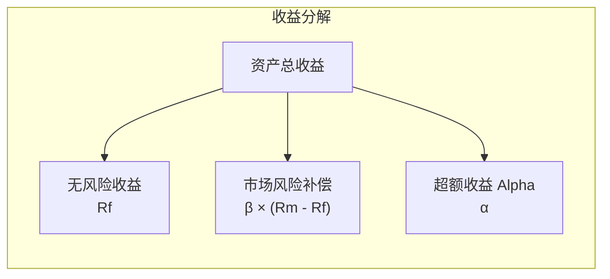
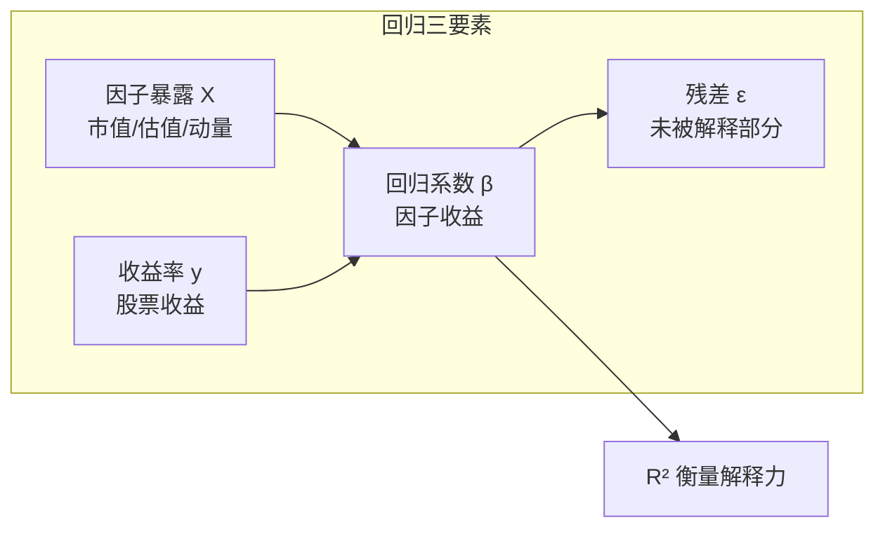
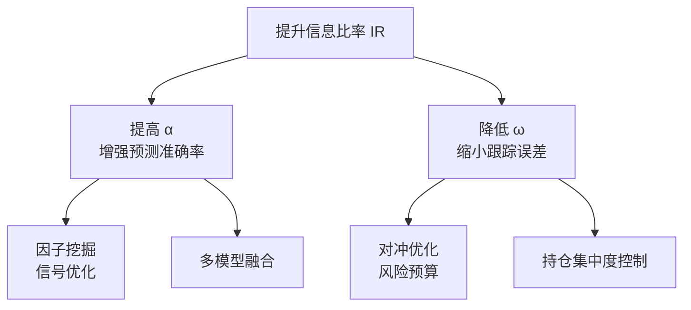
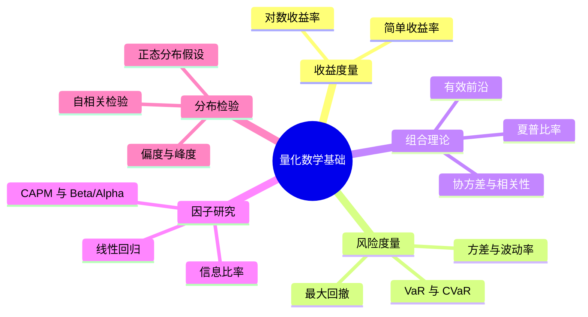

# 量化基础数学公式 — 价值与用法

> 深度解读每个公式背后的投资价值、使用场景与实战用法

---

## 目录

1. [什么是量化？](#1-什么是量化)
2. [收益率与对数收益率](#2-收益率与对数收益率)
3. [期望、方差与协方差](#3-期望方差与协方差)
4. [现代投资组合理论（MPT）](#4-现代投资组合理论mpt)
5. [夏普比率（Sharpe Ratio）](#5-夏普比率sharpe-ratio)
6. [最大回撤（Maximum Drawdown）](#6-最大回撤maximum-drawdown)
7. [资本资产定价模型（CAPM）](#7-资本资产定价模型capm)
8. [正态分布与假设检验](#8-正态分布与假设检验)
9. [时间序列基础](#9-时间序列基础)
10. [线性回归在量化中的应用](#10-线性回归在量化中的应用)
11. [信息比率（Information Ratio）](#11-信息比率information-ratio)
12. [风险价值（VaR & CVaR）](#12-风险价值var--cvar)

---

## 1. 什么是量化？

量化（Quantitative）是将**投资逻辑、交易策略、风险管理等金融决策过程**，用数学模型和统计方法进行系统化表达与执行的方法论。它的核心思想是：**用数据驱动决策，以概率思维替代主观判断**。

> **量化的三大核心优势**
>
> **① 纪律性** — 消除情绪干扰，严格执行既定策略；
> **② 可验证性** — 每个想法都可以通过历史回测验证有效性；
> **③ 可扩展性** — 一套模型可同时覆盖数千只标的，人力无法做到。

---

## 2. 收益率与对数收益率

### 简单收益率

$$R_t = \frac{P_t - P_{t-1}}{P_{t-1}} = \frac{P_t}{P_{t-1}} - 1$$

**价值**：最直观的收益衡量方式，**直接反映"投了 100 元，赚了多少"**。适合向非技术人群展示策略表现。

**用法**：计算单期收益、展示净值曲线时使用。但简单收益率**不可直接相加**——今天的 +1% 和明天的 +1%，不等于总共 +2%。

### 对数收益率

$$r_t = \ln\left(\frac{P_t}{P_{t-1}}\right) = \ln(P_t) - \ln(P_{t-1})$$

**价值**：**量化建模的"标准语言"**。对数收益率具备可加性、近似正态分布，是几乎所有统计模型（回归、协方差、VaR）的输入基础。

**用法**：多期对数收益率 = 各期对数收益率之和。在 Python 中，`np.log(price).diff()` 一行即可得到对数收益率序列。

**图1：简单收益率 vs 对数收益率对比（大幅波动模拟数据，差异放大至可视）**

<svg xmlns="http://www.w3.org/2000/svg" viewBox="0 0 720 480" width="100%" style="max-width:720px;font-family:-apple-system,BlinkMacSystemFont,'Segoe UI','PingFang SC','Microsoft YaHei',sans-serif">
  <rect x="0" y="0" width="720" height="480" fill="#fafbfc" rx="8"/>
  <line x1="65" y1="410.0" x2="690" y2="410.0" stroke="#e8ecf1" stroke-width="0.5" stroke-dasharray="4,3"/>  <text x="57" y="414.0" text-anchor="end" fill="#64748b" font-size="11">-40%</text>  <line x1="65" y1="318.8" x2="690" y2="318.8" stroke="#e8ecf1" stroke-width="0.5" stroke-dasharray="4,3"/>  <text x="57" y="322.8" text-anchor="end" fill="#64748b" font-size="11">-20%</text>  <line x1="65" y1="227.5" x2="690" y2="227.5" stroke="#e8ecf1" stroke-width="0.5" stroke-dasharray="4,3"/>  <text x="57" y="231.5" text-anchor="end" fill="#64748b" font-size="11">0%</text>  <line x1="65" y1="136.2" x2="690" y2="136.2" stroke="#e8ecf1" stroke-width="0.5" stroke-dasharray="4,3"/>  <text x="57" y="140.2" text-anchor="end" fill="#64748b" font-size="11">20%</text>  <line x1="65" y1="45.0" x2="690" y2="45.0" stroke="#e8ecf1" stroke-width="0.5" stroke-dasharray="4,3"/>  <text x="57" y="49.0" text-anchor="end" fill="#64748b" font-size="11">40%</text>
  <line x1="65.0" y1="45" x2="65.0" y2="410" stroke="#e8ecf1" stroke-width="0.5" stroke-dasharray="4,3"/>  <text x="65.0" y="428" text-anchor="middle" fill="#64748b" font-size="11">0</text>  <line x1="192.6" y1="45" x2="192.6" y2="410" stroke="#e8ecf1" stroke-width="0.5" stroke-dasharray="4,3"/>  <text x="192.6" y="428" text-anchor="middle" fill="#64748b" font-size="11">10</text>  <line x1="320.1" y1="45" x2="320.1" y2="410" stroke="#e8ecf1" stroke-width="0.5" stroke-dasharray="4,3"/>  <text x="320.1" y="428" text-anchor="middle" fill="#64748b" font-size="11">20</text>  <line x1="447.7" y1="45" x2="447.7" y2="410" stroke="#e8ecf1" stroke-width="0.5" stroke-dasharray="4,3"/>  <text x="447.7" y="428" text-anchor="middle" fill="#64748b" font-size="11">30</text>  <line x1="575.2" y1="45" x2="575.2" y2="410" stroke="#e8ecf1" stroke-width="0.5" stroke-dasharray="4,3"/>  <text x="575.2" y="428" text-anchor="middle" fill="#64748b" font-size="11">40</text>  <line x1="702.8" y1="45" x2="702.8" y2="410" stroke="#e8ecf1" stroke-width="0.5" stroke-dasharray="4,3"/>  <text x="702.8" y="428" text-anchor="middle" fill="#64748b" font-size="11">50</text>
  <!-- Axes -->
  <line x1="65" y1="45" x2="65" y2="410" stroke="#cbd5e1" stroke-width="1"/>
  <line x1="65" y1="410" x2="690" y2="410" stroke="#cbd5e1" stroke-width="1"/>
  <!-- Axis labels -->
  <text x="360" y="465" text-anchor="middle" fill="#64748b" font-size="12">交易日</text>
  <text x="18" y="227" text-anchor="middle" fill="#64748b" font-size="12" transform="rotate(-90,18,227)">收益率 (%)</text>
  <!-- Legend -->
  <line x1="430" y1="25" x2="450" y2="25" stroke="#2563eb" stroke-width="2.5"/>
  <text x="456" y="29" fill="#334155" font-size="12">简单收益率</text>
  <line x1="550" y1="25" x2="570" y2="25" stroke="#059669" stroke-width="2.5" stroke-dasharray="6,3"/>
  <text x="576" y="29" fill="#334155" font-size="12">对数收益率</text>
  <!-- Zero line emphasis -->
  <line x1="65" y1="227.5" x2="690" y2="227.5" stroke="#94a3b8" stroke-width="0.8" stroke-dasharray="2,2"/>
  <!-- Simple return line (solid blue) -->
  <polyline points="65.0,195.7 77.8,335.9 90.5,278.8 103.3,290.6 116.0,173.6 128.8,187.2 141.5,138.0 154.3,321.7 167.0,245.3 179.8,334.8 192.6,291.7 205.3,226.3 218.1,335.5 230.8,296.2 243.6,193.3 256.3,217.2 269.1,291.3 281.8,207.1 294.6,156.9 307.3,340.1 320.1,157.7 332.9,182.3 345.6,263.9 358.4,306.1 371.1,123.2 383.9,264.8 396.6,320.4 409.4,319.5 422.1,148.2 434.9,203.8 447.7,157.4 460.4,175.1 473.2,219.2 485.9,119.6 498.7,255.2 511.4,215.6 524.2,152.4 536.9,200.5 549.7,145.0 562.4,209.9 575.2,180.8 588.0,331.1 600.7,289.6 613.5,275.5 626.2,323.4 639.0,288.5 651.7,318.5 664.5,278.1 677.2,196.5 690.0,258.3" fill="none" stroke="#2563eb" stroke-width="2" stroke-linejoin="round" stroke-linecap="round"/>
  <!-- Log return line (dashed green) -->
  <polyline points="65.0,196.8 77.8,351.2 90.5,281.9 103.3,295.5 116.0,176.5 128.8,188.9 141.5,145.8 154.3,333.0 167.0,245.7 179.8,349.8 192.6,296.7 205.3,226.3 218.1,350.8 230.8,302.0 243.6,194.5 256.3,217.4 269.1,296.2 281.8,207.6 294.6,161.9 307.3,356.8 320.1,162.6 332.9,184.4 345.6,265.5 358.4,313.8 371.1,133.6 383.9,266.4 396.6,331.4 409.4,330.2 422.1,154.4 434.9,204.4 447.7,162.3 460.4,177.9 473.2,219.3 485.9,130.6 498.7,256.1 511.4,215.8 524.2,157.9 536.9,201.2 549.7,151.7 562.4,210.2 575.2,183.1 588.0,345.0 600.7,294.2 613.5,278.3 626.2,335.1 639.0,292.9 651.7,329.0 664.5,281.2 677.2,197.6 690.0,259.4" fill="none" stroke="#059669" stroke-width="2" stroke-dasharray="6,3" stroke-linejoin="round" stroke-linecap="round"/>
  <!-- Max difference annotation -->
  <circle cx="307.3" cy="340.1" r="4" fill="none" stroke="#ef4444" stroke-width="1.5"/>
  <line x1="307.3" y1="340.1" x2="337.3" y2="315.1" stroke="#ef4444" stroke-width="1" stroke-dasharray="3,2"/>
  <text x="340.3" y="320.1" fill="#ef4444" font-size="11" font-weight="600">差异 3.7%</text>
</svg>

> 当日收益率较小时（如 < ±5%），简单收益率与对数收益率几乎重合；在大幅波动时（如 ±20%），差异可达数个百分点，如红圈标注处相差 3.7%。

---

## 3. 期望、方差与协方差

### 期望（均值）和方差

$$\mu = E[R] = \frac{1}{n} \sum R_i \quad|\quad \sigma^2 = \text{Var}(R) = \frac{1}{n-1} \sum (R_i - \mu)^2$$

**价值**：期望衡量"平均能赚多少"，方差衡量"收益有多不稳定"。二者是**所有量化策略评价的起点**——没有这两个量，就无法计算夏普比率、无法做回归、无法优化组合。

### 年化波动率

$$\sigma_{\text{annual}} = \sigma_{\text{daily}} \times \sqrt{252}$$

**用法**：中国市场通常取 242~252 个交易日。这是将日频波动率换算为年化值的标准方法，背后的数学原理是**独立随机变量和的方差等于方差之和**。

### 协方差与相关系数

$$\text{Cov}(R_i, R_j) = E[(R_i - \mu_i)(R_j - \mu_j)] \quad|\quad \rho_{ij} = \frac{\text{Cov}(R_i, R_j)}{\sigma_i \cdot \sigma_j}$$

**价值**：**分散化投资的数学基础**。两个资产相关系数越低，组合在一起降低风险的效果越好。现代投资组合理论的核心就是"找到低相关性的资产组合"。

> **关键洞察：** 两个资产各波动 20%，若相关系数为 0，等权组合的波动率仅约 14.1%，而非 20%——这就是分散化的魔力。

**图2：相关系数对组合波动率的影响（两资产等权，各波动 20%）**

<svg xmlns="http://www.w3.org/2000/svg" viewBox="0 0 720 480" width="100%" style="max-width:720px;font-family:-apple-system,BlinkMacSystemFont,'Segoe UI','PingFang SC','Microsoft YaHei',sans-serif">
  <rect x="0" y="0" width="720" height="480" fill="#fafbfc" rx="8"/>
  <defs><linearGradient id="cg1" x1="0" y1="0" x2="0" y2="1"><stop offset="0%" stop-color="#2563eb" stop-opacity="0.15"/><stop offset="100%" stop-color="#2563eb" stop-opacity="0.02"/></linearGradient></defs>
  <line x1="60" y1="410.0" x2="690" y2="410.0" stroke="#e8ecf1" stroke-width="0.5" stroke-dasharray="4,3"/>
  <text x="52" y="414.0" text-anchor="end" fill="#64748b" font-size="11">0</text>
  <line x1="60" y1="328.2" x2="690" y2="328.2" stroke="#e8ecf1" stroke-width="0.5" stroke-dasharray="4,3"/>
  <text x="52" y="332.2" text-anchor="end" fill="#64748b" font-size="11">5</text>
  <line x1="60" y1="246.4" x2="690" y2="246.4" stroke="#e8ecf1" stroke-width="0.5" stroke-dasharray="4,3"/>
  <text x="52" y="250.4" text-anchor="end" fill="#64748b" font-size="11">10</text>
  <line x1="60" y1="164.5" x2="690" y2="164.5" stroke="#e8ecf1" stroke-width="0.5" stroke-dasharray="4,3"/>
  <text x="52" y="168.5" text-anchor="end" fill="#64748b" font-size="11">15</text>
  <line x1="60" y1="82.7" x2="690" y2="82.7" stroke="#e8ecf1" stroke-width="0.5" stroke-dasharray="4,3"/>
  <text x="52" y="86.7" text-anchor="end" fill="#64748b" font-size="11">20</text>
  <line x1="60.0" y1="50" x2="60.0" y2="410" stroke="#e8ecf1" stroke-width="0.5" stroke-dasharray="4,3"/>
  <text x="60.0" y="428" text-anchor="middle" fill="#64748b" font-size="11">-1.0</text>
  <line x1="217.5" y1="50" x2="217.5" y2="410" stroke="#e8ecf1" stroke-width="0.5" stroke-dasharray="4,3"/>
  <text x="217.5" y="428" text-anchor="middle" fill="#64748b" font-size="11">-0.5</text>
  <line x1="375.0" y1="50" x2="375.0" y2="410" stroke="#e8ecf1" stroke-width="0.5" stroke-dasharray="4,3"/>
  <text x="375.0" y="428" text-anchor="middle" fill="#64748b" font-size="11">0</text>
  <line x1="532.5" y1="50" x2="532.5" y2="410" stroke="#e8ecf1" stroke-width="0.5" stroke-dasharray="4,3"/>
  <text x="532.5" y="428" text-anchor="middle" fill="#64748b" font-size="11">0.5</text>
  <line x1="690.0" y1="50" x2="690.0" y2="410" stroke="#e8ecf1" stroke-width="0.5" stroke-dasharray="4,3"/>
  <text x="690.0" y="428" text-anchor="middle" fill="#64748b" font-size="11">1.0</text>
  <line x1="60" y1="50" x2="60" y2="410" stroke="#cbd5e1" stroke-width="1"/>
  <line x1="60" y1="410" x2="690" y2="410" stroke="#cbd5e1" stroke-width="1"/>
  <text x="375" y="452" text-anchor="middle" fill="#64748b" font-size="12">相关系数</text>
  <text x="22" y="230" text-anchor="middle" fill="#64748b" font-size="12" transform="rotate(-90,22,230)">组合波动率 (%)</text>
  <polygon points="60.0,410.0 60.0,410.0 63.2,386.9 66.3,377.3 69.5,369.9 72.6,363.7 75.8,358.3 78.9,353.3 82.0,348.8 85.2,344.5 88.3,340.6 91.5,336.8 94.7,333.2 97.8,329.8 101.0,326.6 104.1,323.4 107.2,320.4 110.4,317.4 113.6,314.6 116.7,311.8 119.8,309.1 123.0,306.5 126.1,304.0 129.3,301.5 132.4,299.0 135.6,296.6 138.8,294.3 141.9,292.0 145.1,289.8 148.2,287.5 151.4,285.4 154.5,283.2 157.7,281.2 160.8,279.1 163.9,277.1 167.1,275.1 170.2,273.1 173.4,271.1 176.6,269.2 179.7,267.3 182.9,265.5 186.0,263.6 189.2,261.8 192.3,260.0 195.5,258.2 198.6,256.5 201.8,254.8 204.9,253.0 208.0,251.3 211.2,249.7 214.3,248.0 217.5,246.4 220.7,244.7 223.8,243.1 227.0,241.5 230.1,239.9 233.2,238.4 236.4,236.8 239.6,235.3 242.7,233.8 245.9,232.2 249.0,230.7 252.2,229.3 255.3,227.8 258.4,226.3 261.6,224.9 264.8,223.4 267.9,222.0 271.0,220.6 274.2,219.2 277.4,217.8 280.5,216.4 283.6,215.0 286.8,213.6 289.9,212.3 293.1,210.9 296.2,209.6 299.4,208.3 302.6,206.9 305.7,205.6 308.9,204.3 312.0,203.0 315.1,201.7 318.3,200.4 321.4,199.2 324.6,197.9 327.8,196.6 330.9,195.4 334.1,194.1 337.2,192.9 340.4,191.7 343.5,190.5 346.7,189.2 349.8,188.0 352.9,186.8 356.1,185.6 359.2,184.4 362.4,183.3 365.6,182.1 368.7,180.9 371.9,179.7 375.0,178.6 378.1,177.4 381.3,176.3 384.4,175.1 387.6,174.0 390.8,172.9 393.9,171.7 397.1,170.6 400.2,169.5 403.4,168.4 406.5,167.3 409.7,166.2 412.8,165.1 415.9,164.0 419.1,162.9 422.2,161.8 425.4,160.8 428.5,159.7 431.7,158.6 434.8,157.6 438.0,156.5 441.1,155.4 444.3,154.4 447.4,153.3 450.6,152.3 453.8,151.3 456.9,150.2 460.1,149.2 463.2,148.2 466.4,147.2 469.5,146.1 472.7,145.1 475.8,144.1 479.0,143.1 482.1,142.1 485.2,141.1 488.4,140.1 491.6,139.1 494.7,138.1 497.9,137.2 501.0,136.2 504.1,135.2 507.3,134.2 510.4,133.3 513.6,132.3 516.8,131.3 519.9,130.4 523.0,129.4 526.2,128.5 529.4,127.5 532.5,126.6 535.6,125.6 538.8,124.7 542.0,123.8 545.1,122.8 548.2,121.9 551.4,121.0 554.5,120.0 557.7,119.1 560.8,118.2 564.0,117.3 567.1,116.4 570.3,115.5 573.4,114.5 576.6,113.6 579.8,112.7 582.9,111.8 586.0,110.9 589.2,110.0 592.4,109.2 595.5,108.3 598.6,107.4 601.8,106.5 605.0,105.6 608.1,104.7 611.2,103.9 614.4,103.0 617.5,102.1 620.7,101.3 623.9,100.4 627.0,99.5 630.1,98.7 633.3,97.8 636.5,96.9 639.6,96.1 642.8,95.2 645.9,94.4 649.1,93.5 652.2,92.7 655.4,91.9 658.5,91.0 661.7,90.2 664.8,89.3 668.0,88.5 671.1,87.7 674.2,86.8 677.4,86.0 680.5,85.2 683.7,84.4 686.9,83.5 690.0,82.7 690.0,410.0" fill="url(#cg1)"/>
  <polyline points="60.0,410.0 63.2,386.9 66.3,377.3 69.5,369.9 72.6,363.7 75.8,358.3 78.9,353.3 82.0,348.8 85.2,344.5 88.3,340.6 91.5,336.8 94.7,333.2 97.8,329.8 101.0,326.6 104.1,323.4 107.2,320.4 110.4,317.4 113.6,314.6 116.7,311.8 119.8,309.1 123.0,306.5 126.1,304.0 129.3,301.5 132.4,299.0 135.6,296.6 138.8,294.3 141.9,292.0 145.1,289.8 148.2,287.5 151.4,285.4 154.5,283.2 157.7,281.2 160.8,279.1 163.9,277.1 167.1,275.1 170.2,273.1 173.4,271.1 176.6,269.2 179.7,267.3 182.9,265.5 186.0,263.6 189.2,261.8 192.3,260.0 195.5,258.2 198.6,256.5 201.8,254.8 204.9,253.0 208.0,251.3 211.2,249.7 214.3,248.0 217.5,246.4 220.7,244.7 223.8,243.1 227.0,241.5 230.1,239.9 233.2,238.4 236.4,236.8 239.6,235.3 242.7,233.8 245.9,232.2 249.0,230.7 252.2,229.3 255.3,227.8 258.4,226.3 261.6,224.9 264.8,223.4 267.9,222.0 271.0,220.6 274.2,219.2 277.4,217.8 280.5,216.4 283.6,215.0 286.8,213.6 289.9,212.3 293.1,210.9 296.2,209.6 299.4,208.3 302.6,206.9 305.7,205.6 308.9,204.3 312.0,203.0 315.1,201.7 318.3,200.4 321.4,199.2 324.6,197.9 327.8,196.6 330.9,195.4 334.1,194.1 337.2,192.9 340.4,191.7 343.5,190.5 346.7,189.2 349.8,188.0 352.9,186.8 356.1,185.6 359.2,184.4 362.4,183.3 365.6,182.1 368.7,180.9 371.9,179.7 375.0,178.6 378.1,177.4 381.3,176.3 384.4,175.1 387.6,174.0 390.8,172.9 393.9,171.7 397.1,170.6 400.2,169.5 403.4,168.4 406.5,167.3 409.7,166.2 412.8,165.1 415.9,164.0 419.1,162.9 422.2,161.8 425.4,160.8 428.5,159.7 431.7,158.6 434.8,157.6 438.0,156.5 441.1,155.4 444.3,154.4 447.4,153.3 450.6,152.3 453.8,151.3 456.9,150.2 460.1,149.2 463.2,148.2 466.4,147.2 469.5,146.1 472.7,145.1 475.8,144.1 479.0,143.1 482.1,142.1 485.2,141.1 488.4,140.1 491.6,139.1 494.7,138.1 497.9,137.2 501.0,136.2 504.1,135.2 507.3,134.2 510.4,133.3 513.6,132.3 516.8,131.3 519.9,130.4 523.0,129.4 526.2,128.5 529.4,127.5 532.5,126.6 535.6,125.6 538.8,124.7 542.0,123.8 545.1,122.8 548.2,121.9 551.4,121.0 554.5,120.0 557.7,119.1 560.8,118.2 564.0,117.3 567.1,116.4 570.3,115.5 573.4,114.5 576.6,113.6 579.8,112.7 582.9,111.8 586.0,110.9 589.2,110.0 592.4,109.2 595.5,108.3 598.6,107.4 601.8,106.5 605.0,105.6 608.1,104.7 611.2,103.9 614.4,103.0 617.5,102.1 620.7,101.3 623.9,100.4 627.0,99.5 630.1,98.7 633.3,97.8 636.5,96.9 639.6,96.1 642.8,95.2 645.9,94.4 649.1,93.5 652.2,92.7 655.4,91.9 658.5,91.0 661.7,90.2 664.8,89.3 668.0,88.5 671.1,87.7 674.2,86.8 677.4,86.0 680.5,85.2 683.7,84.4 686.9,83.5 690.0,82.7" fill="none" stroke="#2563eb" stroke-width="2.5" stroke-linecap="round"/>
  <circle cx="375.0" cy="178.6" r="5" fill="#059669" stroke="#fff" stroke-width="2"/>
  <line x1="375.0" y1="178.6" x2="375.0" y2="148.6" stroke="#059669" stroke-width="1" stroke-dasharray="3,3"/>
  <text x="375.0" y="140.6" text-anchor="middle" fill="#059669" font-size="12" font-weight="600">rho=0: 14.1%</text>
</svg>

---

## 4. 现代投资组合理论（MPT）

马科维茨 1952 年提出的核心思想：**不只看单个资产的收益和风险，更要看组合整体的收益风险比**。

$$\sigma_p^2 = \sum_i \sum_j w_i w_j \sigma_i \sigma_j \rho_{ij} = \mathbf{w}^T \boldsymbol{\Sigma} \mathbf{w}$$

**价值**：这个公式揭示了**组合风险 ≠ 单个资产风险的简单加权**。当资产间相关性小于 1 时，组合风险低于加权平均风险——这就是"免费午餐"的来源。

**用法**：构建有效前沿：用优化器求解在给定收益下最小化风险（或给定风险下最大化收益）的权重组合。Python 中常用 `scipy.optimize.minimize` 实现。

**图3：有效前沿 — 曲线上的点代表给定风险下收益最高的组合**

<svg xmlns="http://www.w3.org/2000/svg" viewBox="0 0 720 480" width="100%" style="max-width:720px;font-family:-apple-system,BlinkMacSystemFont,'Segoe UI','PingFang SC','Microsoft YaHei',sans-serif">
  <rect x="0" y="0" width="720" height="480" fill="#fafbfc" rx="8"/>
  <defs><linearGradient id="efg" x1="0" y1="0" x2="0" y2="1"><stop offset="0%" stop-color="#2563eb" stop-opacity="0.12"/><stop offset="100%" stop-color="#2563eb" stop-opacity="0.02"/></linearGradient></defs>
  <line x1="60" y1="410.0" x2="690" y2="410.0" stroke="#e8ecf1" stroke-width="0.5" stroke-dasharray="4,3"/>
  <text x="52" y="414.0" text-anchor="end" fill="#64748b" font-size="11">0</text>
  <line x1="60" y1="350.0" x2="690" y2="350.0" stroke="#e8ecf1" stroke-width="0.5" stroke-dasharray="4,3"/>
  <text x="52" y="354.0" text-anchor="end" fill="#64748b" font-size="11">3</text>
  <line x1="60" y1="290.0" x2="690" y2="290.0" stroke="#e8ecf1" stroke-width="0.5" stroke-dasharray="4,3"/>
  <text x="52" y="294.0" text-anchor="end" fill="#64748b" font-size="11">6</text>
  <line x1="60" y1="230.0" x2="690" y2="230.0" stroke="#e8ecf1" stroke-width="0.5" stroke-dasharray="4,3"/>
  <text x="52" y="234.0" text-anchor="end" fill="#64748b" font-size="11">9</text>
  <line x1="60" y1="170.0" x2="690" y2="170.0" stroke="#e8ecf1" stroke-width="0.5" stroke-dasharray="4,3"/>
  <text x="52" y="174.0" text-anchor="end" fill="#64748b" font-size="11">12</text>
  <line x1="60" y1="110.0" x2="690" y2="110.0" stroke="#e8ecf1" stroke-width="0.5" stroke-dasharray="4,3"/>
  <text x="52" y="114.0" text-anchor="end" fill="#64748b" font-size="11">15</text>
  <line x1="60" y1="50.0" x2="690" y2="50.0" stroke="#e8ecf1" stroke-width="0.5" stroke-dasharray="4,3"/>
  <text x="52" y="54.0" text-anchor="end" fill="#64748b" font-size="11">18</text>
  <line x1="60.0" y1="50" x2="60.0" y2="410" stroke="#e8ecf1" stroke-width="0.5" stroke-dasharray="4,3"/>
  <text x="60.0" y="428" text-anchor="middle" fill="#64748b" font-size="11">0</text>
  <line x1="150.0" y1="50" x2="150.0" y2="410" stroke="#e8ecf1" stroke-width="0.5" stroke-dasharray="4,3"/>
  <text x="150.0" y="428" text-anchor="middle" fill="#64748b" font-size="11">5</text>
  <line x1="240.0" y1="50" x2="240.0" y2="410" stroke="#e8ecf1" stroke-width="0.5" stroke-dasharray="4,3"/>
  <text x="240.0" y="428" text-anchor="middle" fill="#64748b" font-size="11">10</text>
  <line x1="330.0" y1="50" x2="330.0" y2="410" stroke="#e8ecf1" stroke-width="0.5" stroke-dasharray="4,3"/>
  <text x="330.0" y="428" text-anchor="middle" fill="#64748b" font-size="11">15</text>
  <line x1="420.0" y1="50" x2="420.0" y2="410" stroke="#e8ecf1" stroke-width="0.5" stroke-dasharray="4,3"/>
  <text x="420.0" y="428" text-anchor="middle" fill="#64748b" font-size="11">20</text>
  <line x1="510.0" y1="50" x2="510.0" y2="410" stroke="#e8ecf1" stroke-width="0.5" stroke-dasharray="4,3"/>
  <text x="510.0" y="428" text-anchor="middle" fill="#64748b" font-size="11">25</text>
  <line x1="600.0" y1="50" x2="600.0" y2="410" stroke="#e8ecf1" stroke-width="0.5" stroke-dasharray="4,3"/>
  <text x="600.0" y="428" text-anchor="middle" fill="#64748b" font-size="11">30</text>
  <line x1="690.0" y1="50" x2="690.0" y2="410" stroke="#e8ecf1" stroke-width="0.5" stroke-dasharray="4,3"/>
  <text x="690.0" y="428" text-anchor="middle" fill="#64748b" font-size="11">35</text>
  <line x1="60" y1="50" x2="60" y2="410" stroke="#cbd5e1" stroke-width="1"/>
  <line x1="60" y1="410" x2="690" y2="410" stroke="#cbd5e1" stroke-width="1"/>
  <text x="375" y="452" text-anchor="middle" fill="#64748b" font-size="12">风险 — 年化波动率 (%)</text>
  <text x="22" y="230" text-anchor="middle" fill="#64748b" font-size="12" transform="rotate(-90,22,230)">预期收益 — 年化 (%)</text>
  <polygon points="150.0,410.0 150.0,330.0 186.0,290.0 240.0,240.0 294.0,200.0 348.0,170.0 420.0,140.0 510.0,120.0 600.0,110.0 600.0,410.0" fill="url(#efg)"/>
  <polyline points="150.0,330.0 186.0,290.0 240.0,240.0 294.0,200.0 348.0,170.0 420.0,140.0 510.0,120.0 600.0,110.0" fill="none" stroke="#2563eb" stroke-width="2.5" stroke-linecap="round" stroke-linejoin="round"/>
  <circle cx="150.0" cy="330.0" r="7" fill="#94a3b8" stroke="#fff" stroke-width="2"/>
  <text x="150.0" y="316.0" text-anchor="middle" fill="#475569" font-size="11">债券</text>
  <circle cx="384.0" cy="210.0" r="7" fill="#94a3b8" stroke="#fff" stroke-width="2"/>
  <text x="384.0" y="196.0" text-anchor="middle" fill="#475569" font-size="11">股票A</text>
  <circle cx="510.0" cy="130.0" r="7" fill="#94a3b8" stroke="#fff" stroke-width="2"/>
  <text x="510.0" y="116.0" text-anchor="middle" fill="#475569" font-size="11">股票B</text>
  <circle cx="420.0" cy="270.0" r="7" fill="#94a3b8" stroke="#fff" stroke-width="2"/>
  <text x="420.0" y="256.0" text-anchor="middle" fill="#475569" font-size="11">商品</text>
  <circle cx="294.0" cy="200.0" r="6" fill="#059669" stroke="#fff" stroke-width="2"/>
  <text x="294.0" y="186.0" text-anchor="middle" fill="#059669" font-size="11" font-weight="600">最优组合</text>
  <line x1="440" y1="25" x2="460" y2="25" stroke="#2563eb" stroke-width="2.5"/>
  <text x="466" y="29" fill="#334155" font-size="12">有效前沿</text>
  <circle cx="555" cy="25" r="5" fill="#94a3b8" stroke="#fff" stroke-width="1.5"/>
  <text x="565" y="29" fill="#334155" font-size="12">单个资产</text>
</svg>

> **实践中注意：** MPT 对输入参数（预期收益、协方差）极度敏感，输入微小的误差可能导致权重剧烈变化。实践中常用 Black-Litterman 模型或稳健优化来缓解这一问题。

---

## 5. 夏普比率（Sharpe Ratio）

$$\text{Sharpe} = \frac{R_p - R_f}{\sigma_p}$$

**价值**：**量化策略的"统一度量衡"**。它回答了一个核心问题：每承担一单位风险，策略给了你多少超额回报？

| 夏普比率 | 评价 | 说明 |
|---------|------|------|
| < 0.5 | 较差 | 不值得承担风险 |
| 0.5 ~ 1.0 | 一般 | 市场平均水平 |
| 1.0 ~ 2.0 | 良好 | 有显著超额收益 |
| > 2.0 | 优秀 | 顶级量化策略 |

**用法**：年化公式为 $\sqrt{252} \times (\text{日均超额收益} / \text{日波动率})$。**夏普比率 > 1 的策略才值得投入实盘资金**。但需注意：夏普比率假设收益服从正态分布，对尾部风险不敏感。

**图4：夏普比率与策略评价等级**

<svg xmlns="http://www.w3.org/2000/svg" viewBox="0 0 720 480" width="100%" style="max-width:720px;font-family:-apple-system,BlinkMacSystemFont,'Segoe UI','PingFang SC','Microsoft YaHei',sans-serif">
  <rect x="0" y="0" width="720" height="480" fill="#fafbfc" rx="8"/>
  <rect x="60.0" y="50" width="105.0" height="45" fill="#fecaca" rx="4" opacity="0.6"/>
  <text x="112.5" y="70" text-anchor="middle" fill="#dc2626" font-size="13" font-weight="600">较差</text>
  <text x="112.5" y="88" text-anchor="middle" fill="#dc2626" font-size="11">0-0.5</text>
  <rect x="165.0" y="50" width="105.0" height="45" fill="#fed7aa" rx="4" opacity="0.6"/>
  <text x="217.5" y="70" text-anchor="middle" fill="#ea580c" font-size="13" font-weight="600">一般</text>
  <text x="217.5" y="88" text-anchor="middle" fill="#ea580c" font-size="11">0.5-1.0</text>
  <rect x="270.0" y="50" width="210.0" height="45" fill="#bbf7d0" rx="4" opacity="0.6"/>
  <text x="375.0" y="70" text-anchor="middle" fill="#16a34a" font-size="13" font-weight="600">良好</text>
  <text x="375.0" y="88" text-anchor="middle" fill="#16a34a" font-size="11">1.0-2.0</text>
  <rect x="480.0" y="50" width="210.0" height="45" fill="#86efac" rx="4" opacity="0.6"/>
  <text x="585.0" y="70" text-anchor="middle" fill="#15803d" font-size="13" font-weight="600">优秀</text>
  <text x="585.0" y="88" text-anchor="middle" fill="#15803d" font-size="11">2.0-3.0</text>
  <line x1="60" y1="420" x2="690" y2="420" stroke="#cbd5e1" stroke-width="1"/>
  <line x1="60" y1="115" x2="60" y2="420" stroke="#cbd5e1" stroke-width="1"/>
  <line x1="60" y1="420.0" x2="690" y2="420.0" stroke="#e8ecf1" stroke-width="0.5" stroke-dasharray="4,3"/>
  <text x="52" y="424.0" text-anchor="end" fill="#64748b" font-size="11">0</text>
  <line x1="60" y1="359.0" x2="690" y2="359.0" stroke="#e8ecf1" stroke-width="0.5" stroke-dasharray="4,3"/>
  <text x="52" y="363.0" text-anchor="end" fill="#64748b" font-size="11">20</text>
  <line x1="60" y1="298.0" x2="690" y2="298.0" stroke="#e8ecf1" stroke-width="0.5" stroke-dasharray="4,3"/>
  <text x="52" y="302.0" text-anchor="end" fill="#64748b" font-size="11">40</text>
  <line x1="60" y1="237.0" x2="690" y2="237.0" stroke="#e8ecf1" stroke-width="0.5" stroke-dasharray="4,3"/>
  <text x="52" y="241.0" text-anchor="end" fill="#64748b" font-size="11">60</text>
  <line x1="60" y1="176.0" x2="690" y2="176.0" stroke="#e8ecf1" stroke-width="0.5" stroke-dasharray="4,3"/>
  <text x="52" y="180.0" text-anchor="end" fill="#64748b" font-size="11">80</text>
  <line x1="60" y1="115.0" x2="690" y2="115.0" stroke="#e8ecf1" stroke-width="0.5" stroke-dasharray="4,3"/>
  <text x="52" y="119.0" text-anchor="end" fill="#64748b" font-size="11">100</text>
  <line x1="60.0" y1="420" x2="60.0" y2="425" stroke="#cbd5e1" stroke-width="1"/>
  <text x="60.0" y="440" text-anchor="middle" fill="#64748b" font-size="11">0</text>
  <line x1="165.0" y1="420" x2="165.0" y2="425" stroke="#cbd5e1" stroke-width="1"/>
  <text x="165.0" y="440" text-anchor="middle" fill="#64748b" font-size="11">0.5</text>
  <line x1="270.0" y1="420" x2="270.0" y2="425" stroke="#cbd5e1" stroke-width="1"/>
  <text x="270.0" y="440" text-anchor="middle" fill="#64748b" font-size="11">1.0</text>
  <line x1="375.0" y1="420" x2="375.0" y2="425" stroke="#cbd5e1" stroke-width="1"/>
  <text x="375.0" y="440" text-anchor="middle" fill="#64748b" font-size="11">1.5</text>
  <line x1="480.0" y1="420" x2="480.0" y2="425" stroke="#cbd5e1" stroke-width="1"/>
  <text x="480.0" y="440" text-anchor="middle" fill="#64748b" font-size="11">2.0</text>
  <line x1="585.0" y1="420" x2="585.0" y2="425" stroke="#cbd5e1" stroke-width="1"/>
  <text x="585.0" y="440" text-anchor="middle" fill="#64748b" font-size="11">2.5</text>
  <line x1="690.0" y1="420" x2="690.0" y2="425" stroke="#cbd5e1" stroke-width="1"/>
  <text x="690.0" y="440" text-anchor="middle" fill="#64748b" font-size="11">3.0</text>
  <text x="375" y="460" text-anchor="middle" fill="#64748b" font-size="12">夏普比率</text>
  <text x="22" y="267" text-anchor="middle" fill="#64748b" font-size="12" transform="rotate(-90,22,267)">策略评价得分</text>
  <rect x="68.5" y="374.2" width="25" height="45.8" fill="#2563eb" rx="2" opacity="0.75"/>
  <text x="81.0" y="369.2" text-anchor="middle" fill="#1e40af" font-size="10">15</text>
  <rect x="110.5" y="328.5" width="25" height="91.5" fill="#2563eb" rx="2" opacity="0.75"/>
  <text x="123.0" y="323.5" text-anchor="middle" fill="#1e40af" font-size="10">30</text>
  <rect x="152.5" y="282.8" width="25" height="137.2" fill="#2563eb" rx="2" opacity="0.75"/>
  <text x="165.0" y="277.8" text-anchor="middle" fill="#1e40af" font-size="10">45</text>
  <rect x="194.5" y="252.2" width="25" height="167.8" fill="#2563eb" rx="2" opacity="0.75"/>
  <text x="207.0" y="247.2" text-anchor="middle" fill="#1e40af" font-size="10">55</text>
  <rect x="236.5" y="221.8" width="25" height="198.2" fill="#2563eb" rx="2" opacity="0.75"/>
  <text x="249.0" y="216.8" text-anchor="middle" fill="#1e40af" font-size="10">65</text>
  <rect x="299.5" y="191.2" width="25" height="228.8" fill="#2563eb" rx="2" opacity="0.75"/>
  <text x="312.0" y="186.2" text-anchor="middle" fill="#1e40af" font-size="10">75</text>
  <rect x="362.5" y="169.9" width="25" height="250.1" fill="#2563eb" rx="2" opacity="0.75"/>
  <text x="375.0" y="164.9" text-anchor="middle" fill="#1e40af" font-size="10">82</text>
  <rect x="425.5" y="151.6" width="25" height="268.4" fill="#2563eb" rx="2" opacity="0.75"/>
  <text x="438.0" y="146.6" text-anchor="middle" fill="#1e40af" font-size="10">88</text>
  <rect x="509.5" y="136.3" width="25" height="283.7" fill="#2563eb" rx="2" opacity="0.75"/>
  <text x="522.0" y="131.3" text-anchor="middle" fill="#1e40af" font-size="10">93</text>
  <rect x="572.5" y="127.2" width="25" height="292.8" fill="#2563eb" rx="2" opacity="0.75"/>
  <text x="585.0" y="122.2" text-anchor="middle" fill="#1e40af" font-size="10">96</text>
  <rect x="635.5" y="121.1" width="25" height="298.9" fill="#2563eb" rx="2" opacity="0.75"/>
  <text x="648.0" y="116.1" text-anchor="middle" fill="#1e40af" font-size="10">98</text>
</svg>

---

## 6. 最大回撤（Maximum Drawdown）

$$\text{MDD} = \max_{t \in [0,T]} \left( \frac{\max_{s \in [0,t]} V_s - V_t}{\max_{s \in [0,t]} V_s} \right)$$

**价值**：**衡量"最坏情况"的核心指标**。夏普比率告诉你"平均表现"，MDD 告诉你"最惨的时候亏了多少"。实盘中，MDD 往往比夏普比率更受关注——因为投资者无法承受"先亏 50% 再赚回来"的过程。

**用法**：从净值曲线中计算：遍历每个时点，记录当前净值与历史最高净值的差距，取最大值。一个优秀的策略通常要求 MDD 控制在 15% 以内。

**图5：净值曲线与回撤可视化**

<svg xmlns="http://www.w3.org/2000/svg" viewBox="0 0 720 480" width="100%" style="max-width:720px;font-family:-apple-system,BlinkMacSystemFont,'Segoe UI','PingFang SC','Microsoft YaHei',sans-serif">
  <rect x="0" y="0" width="720" height="480" fill="#fafbfc" rx="8"/>
  <line x1="60" y1="410.0" x2="690" y2="410.0" stroke="#e8ecf1" stroke-width="0.5" stroke-dasharray="4,3"/>
  <text x="52" y="414.0" text-anchor="end" fill="#64748b" font-size="11">80</text>
  <line x1="60" y1="320.0" x2="690" y2="320.0" stroke="#e8ecf1" stroke-width="0.5" stroke-dasharray="4,3"/>
  <text x="52" y="324.0" text-anchor="end" fill="#64748b" font-size="11">100</text>
  <line x1="60" y1="230.0" x2="690" y2="230.0" stroke="#e8ecf1" stroke-width="0.5" stroke-dasharray="4,3"/>
  <text x="52" y="234.0" text-anchor="end" fill="#64748b" font-size="11">120</text>
  <line x1="60" y1="140.0" x2="690" y2="140.0" stroke="#e8ecf1" stroke-width="0.5" stroke-dasharray="4,3"/>
  <text x="52" y="144.0" text-anchor="end" fill="#64748b" font-size="11">140</text>
  <line x1="60" y1="50.0" x2="690" y2="50.0" stroke="#e8ecf1" stroke-width="0.5" stroke-dasharray="4,3"/>
  <text x="52" y="54.0" text-anchor="end" fill="#64748b" font-size="11">160</text>
  <line x1="60.0" y1="50" x2="60.0" y2="410" stroke="#e8ecf1" stroke-width="0.5" stroke-dasharray="4,3"/>
  <text x="60.0" y="428" text-anchor="middle" fill="#64748b" font-size="11">0</text>
  <line x1="186.0" y1="50" x2="186.0" y2="410" stroke="#e8ecf1" stroke-width="0.5" stroke-dasharray="4,3"/>
  <text x="186.0" y="428" text-anchor="middle" fill="#64748b" font-size="11">15</text>
  <line x1="312.0" y1="50" x2="312.0" y2="410" stroke="#e8ecf1" stroke-width="0.5" stroke-dasharray="4,3"/>
  <text x="312.0" y="428" text-anchor="middle" fill="#64748b" font-size="11">30</text>
  <line x1="438.0" y1="50" x2="438.0" y2="410" stroke="#e8ecf1" stroke-width="0.5" stroke-dasharray="4,3"/>
  <text x="438.0" y="428" text-anchor="middle" fill="#64748b" font-size="11">45</text>
  <line x1="564.0" y1="50" x2="564.0" y2="410" stroke="#e8ecf1" stroke-width="0.5" stroke-dasharray="4,3"/>
  <text x="564.0" y="428" text-anchor="middle" fill="#64748b" font-size="11">60</text>
  <line x1="690.0" y1="50" x2="690.0" y2="410" stroke="#e8ecf1" stroke-width="0.5" stroke-dasharray="4,3"/>
  <text x="690.0" y="428" text-anchor="middle" fill="#64748b" font-size="11">75</text>
  <line x1="60" y1="50" x2="60" y2="410" stroke="#cbd5e1" stroke-width="1"/>
  <line x1="60" y1="410" x2="690" y2="410" stroke="#cbd5e1" stroke-width="1"/>
  <text x="375" y="452" text-anchor="middle" fill="#64748b" font-size="12">交易日</text>
  <text x="22" y="230" text-anchor="middle" fill="#64748b" font-size="12" transform="rotate(-90,22,230)">净值</text>
  <polyline points="60.0,318.5 68.4,316.3 76.8,304.9 85.2,297.2 93.6,290.0 102.0,289.0 110.4,279.9 118.8,279.0 127.2,274.9 135.6,261.6 144.0,253.4 152.4,246.3 160.8,237.1 169.2,225.3 177.6,214.2 186.0,212.1 194.4,213.2 202.8,209.6 211.2,206.8 219.6,204.9 228.0,190.6 236.4,177.1 244.8,173.3 253.2,163.4 261.6,158.0 270.0,161.4 278.4,173.1 286.8,188.0 295.2,202.9 303.6,212.1 312.0,226.1 320.4,234.5 328.8,237.8 337.2,249.0 345.6,262.7 354.0,264.3 362.4,273.2 370.8,288.3 379.2,303.5 387.6,317.4 396.0,323.8 404.4,327.9 412.8,336.9 421.2,350.4 429.6,359.4 438.0,347.1 446.4,340.4 454.8,327.9 463.2,316.5 471.6,316.3 480.0,306.5 488.4,297.0 496.8,289.4 505.2,285.6 513.6,276.3 522.0,274.6 530.4,268.1 538.8,261.3 547.2,246.8 555.6,233.0 564.0,228.8 572.4,220.6 580.8,217.7 589.2,202.6 597.6,187.8 606.0,182.5 614.4,171.3 622.8,160.3 631.2,157.6 639.6,143.5 648.0,133.4 656.4,118.5 664.8,108.2 673.2,108.2 681.6,101.7 690.0,101.3" fill="none" stroke="#2563eb" stroke-width="2.5" stroke-linejoin="round" stroke-linecap="round"/>
  <line x1="690.0" y1="101.3" x2="690.0" y2="101.3" stroke="#94a3b8" stroke-width="1" stroke-dasharray="5,3"/>
  <line x1="690.0" y1="101.3" x2="690.0" y2="101.3" stroke="#ef4444" stroke-width="2" stroke-dasharray="4,3"/>
  <circle cx="690.0" cy="101.3" r="5" fill="#2563eb" stroke="#fff" stroke-width="2"/>
  <text x="690.0" y="89.3" text-anchor="middle" fill="#1e40af" font-size="11" font-weight="600">峰值 149</text>
  <circle cx="690.0" cy="101.3" r="5" fill="#ef4444" stroke="#fff" stroke-width="2"/>
  <text x="690.0" y="123.3" text-anchor="middle" fill="#dc2626" font-size="11" font-weight="600">谷底 149</text>
  <text x="690.0" y="106.3" text-anchor="middle" fill="#dc2626" font-size="13" font-weight="700">MDD ≈ 0.0%</text>
  <line x1="440" y1="25" x2="460" y2="25" stroke="#2563eb" stroke-width="2.5"/>
  <text x="466" y="29" fill="#334155" font-size="12">净值曲线</text>
  <line x1="555" y1="25" x2="575" y2="25" stroke="#ef4444" stroke-width="2" stroke-dasharray="4,3"/>
  <text x="581" y="29" fill="#334155" font-size="12">回撤区间</text>
</svg>

---

## 7. 资本资产定价模型（CAPM）

$$E[R_i] = R_f + \beta_i \cdot (E[R_m] - R_f)$$

**价值**：CAPM 将投资收益分解为两部分：**无风险收益 + 承担市场风险获得的补偿**。Beta 衡量了资产对市场波动的敏感度。

### Beta 和 Alpha

$$\beta_i = \frac{\text{Cov}(R_i, R_m)}{\text{Var}(R_m)} \quad|\quad \alpha_i = R_i - [R_f + \beta_i(R_m - R_f)]$$

| Beta 值 | 含义 | 典型资产 |
|---------|------|---------|
| > 1.5 | 高波动进攻型 | 科技成长股、小盘股 |
| ≈ 1.0 | 与市场同步 | 指数 ETF |
| < 0.5 | 低波动防御型 | 公用事业、消费必需品 |

**用法**：Alpha > 0 表示策略跑赢了仅靠市场 Beta 能解释的收益——**Alpha 是量化策略追求的终极目标**。在 Python 中，用 `statsmodels.api.OLS` 对收益率做回归，截距项即为 Alpha。

> **实战要点：** CAPM 是单因子模型，现实中用 Fama-French 三因子或五因子模型更准确。但 Beta 和 Alpha 的概念框架是所有多因子模型的基础。

---

## 8. 正态分布与假设检验

许多量化模型假设收益率服从正态分布，但**真实金融数据往往呈现"尖峰厚尾"特征**——极端事件发生概率远高于正态分布预测。

### 偏度与峰度

$$\text{偏度 } S = \frac{E[(R - \mu)^3]}{\sigma^3} \quad|\quad \text{峰度 } K = \frac{E[(R - \mu)^4]}{\sigma^4}$$

**价值**：**揭示收益分布的真实形态**。负偏度意味着"经常小赚、偶尔大亏"（如做空波动率策略）；正偏度意味着"经常小亏、偶尔大赚"（如趋势跟踪策略）。

**用法**：峰度 > 3（超额峰度 > 0）说明存在厚尾，此时基于正态分布假设的 VaR 会严重低估风险。量化策略开发中必须检验收益分布的正态性。

**图6：正态分布 vs 厚尾分布 — 金融数据更接近厚尾，极端事件概率更高**

<svg xmlns="http://www.w3.org/2000/svg" viewBox="0 0 720 480" width="100%" style="max-width:720px;font-family:-apple-system,BlinkMacSystemFont,'Segoe UI','PingFang SC','Microsoft YaHei',sans-serif">
  <rect x="0" y="0" width="720" height="480" fill="#fafbfc" rx="8"/>
  <defs><linearGradient id="ng1" x1="0" y1="0" x2="0" y2="1"><stop offset="0%" stop-color="#2563eb" stop-opacity="0.15"/><stop offset="100%" stop-color="#2563eb" stop-opacity="0.02"/></linearGradient></defs>
  <defs><linearGradient id="ng2" x1="0" y1="0" x2="0" y2="1"><stop offset="0%" stop-color="#059669" stop-opacity="0.15"/><stop offset="100%" stop-color="#059669" stop-opacity="0.02"/></linearGradient></defs>
  <line x1="60" y1="410.0" x2="690" y2="410.0" stroke="#e8ecf1" stroke-width="0.5" stroke-dasharray="4,3"/>
  <text x="52" y="414.0" text-anchor="end" fill="#64748b" font-size="11">0</text>
  <line x1="60" y1="330.0" x2="690" y2="330.0" stroke="#e8ecf1" stroke-width="0.5" stroke-dasharray="4,3"/>
  <text x="52" y="334.0" text-anchor="end" fill="#64748b" font-size="11">0.1</text>
  <line x1="60" y1="250.0" x2="690" y2="250.0" stroke="#e8ecf1" stroke-width="0.5" stroke-dasharray="4,3"/>
  <text x="52" y="254.0" text-anchor="end" fill="#64748b" font-size="11">0.2</text>
  <line x1="60" y1="170.0" x2="690" y2="170.0" stroke="#e8ecf1" stroke-width="0.5" stroke-dasharray="4,3"/>
  <text x="52" y="174.0" text-anchor="end" fill="#64748b" font-size="11">0.3</text>
  <line x1="60" y1="90.0" x2="690" y2="90.0" stroke="#e8ecf1" stroke-width="0.5" stroke-dasharray="4,3"/>
  <text x="52" y="94.0" text-anchor="end" fill="#64748b" font-size="11">0.4</text>
  <line x1="60.0" y1="50" x2="60.0" y2="410" stroke="#e8ecf1" stroke-width="0.5" stroke-dasharray="4,3"/>
  <text x="60.0" y="428" text-anchor="middle" fill="#64748b" font-size="11">-4</text>
  <line x1="138.8" y1="50" x2="138.8" y2="410" stroke="#e8ecf1" stroke-width="0.5" stroke-dasharray="4,3"/>
  <text x="138.8" y="428" text-anchor="middle" fill="#64748b" font-size="11">-3</text>
  <line x1="217.5" y1="50" x2="217.5" y2="410" stroke="#e8ecf1" stroke-width="0.5" stroke-dasharray="4,3"/>
  <text x="217.5" y="428" text-anchor="middle" fill="#64748b" font-size="11">-2</text>
  <line x1="296.2" y1="50" x2="296.2" y2="410" stroke="#e8ecf1" stroke-width="0.5" stroke-dasharray="4,3"/>
  <text x="296.2" y="428" text-anchor="middle" fill="#64748b" font-size="11">-1</text>
  <line x1="375.0" y1="50" x2="375.0" y2="410" stroke="#e8ecf1" stroke-width="0.5" stroke-dasharray="4,3"/>
  <text x="375.0" y="428" text-anchor="middle" fill="#64748b" font-size="11">0</text>
  <line x1="453.8" y1="50" x2="453.8" y2="410" stroke="#e8ecf1" stroke-width="0.5" stroke-dasharray="4,3"/>
  <text x="453.8" y="428" text-anchor="middle" fill="#64748b" font-size="11">1</text>
  <line x1="532.5" y1="50" x2="532.5" y2="410" stroke="#e8ecf1" stroke-width="0.5" stroke-dasharray="4,3"/>
  <text x="532.5" y="428" text-anchor="middle" fill="#64748b" font-size="11">2</text>
  <line x1="611.2" y1="50" x2="611.2" y2="410" stroke="#e8ecf1" stroke-width="0.5" stroke-dasharray="4,3"/>
  <text x="611.2" y="428" text-anchor="middle" fill="#64748b" font-size="11">3</text>
  <line x1="690.0" y1="50" x2="690.0" y2="410" stroke="#e8ecf1" stroke-width="0.5" stroke-dasharray="4,3"/>
  <text x="690.0" y="428" text-anchor="middle" fill="#64748b" font-size="11">4</text>
  <line x1="60" y1="50" x2="60" y2="410" stroke="#cbd5e1" stroke-width="1"/>
  <line x1="60" y1="410" x2="690" y2="410" stroke="#cbd5e1" stroke-width="1"/>
  <text x="375" y="452" text-anchor="middle" fill="#64748b" font-size="12">收益率 (标准差)</text>
  <text x="22" y="230" text-anchor="middle" fill="#64748b" font-size="12" transform="rotate(-90,22,230)">概率密度</text>
  <polygon points="60.0,410.0 60.0,409.4 60.8,409.4 61.6,409.3 62.4,409.3 63.2,409.3 63.9,409.3 64.7,409.2 65.5,409.2 66.3,409.2 67.1,409.1 67.9,409.1 68.7,409.1 69.5,409.1 70.2,409.0 71.0,409.0 71.8,408.9 72.6,408.9 73.4,408.9 74.2,408.8 75.0,408.8 75.8,408.8 76.5,408.7 77.3,408.7 78.1,408.6 78.9,408.6 79.7,408.5 80.5,408.5 81.3,408.4 82.0,408.4 82.8,408.3 83.6,408.3 84.4,408.2 85.2,408.1 86.0,408.1 86.8,408.0 87.6,408.0 88.3,407.9 89.1,407.8 89.9,407.8 90.7,407.7 91.5,407.6 92.3,407.5 93.1,407.5 93.9,407.4 94.7,407.3 95.4,407.2 96.2,407.1 97.0,407.0 97.8,406.9 98.6,406.8 99.4,406.7 100.2,406.6 101.0,406.5 101.7,406.4 102.5,406.3 103.3,406.2 104.1,406.1 104.9,406.0 105.7,405.8 106.5,405.7 107.2,405.6 108.0,405.5 108.8,405.3 109.6,405.2 110.4,405.0 111.2,404.9 112.0,404.8 112.8,404.6 113.6,404.4 114.3,404.3 115.1,404.1 115.9,404.0 116.7,403.8 117.5,403.6 118.3,403.4 119.1,403.2 119.8,403.0 120.6,402.8 121.4,402.6 122.2,402.4 123.0,402.2 123.8,402.0 124.6,401.8 125.4,401.6 126.1,401.3 126.9,401.1 127.7,400.9 128.5,400.6 129.3,400.4 130.1,400.1 130.9,399.9 131.7,399.6 132.4,399.3 133.2,399.0 134.0,398.7 134.8,398.4 135.6,398.1 136.4,397.8 137.2,397.5 138.0,397.2 138.8,396.9 139.5,396.5 140.3,396.2 141.1,395.9 141.9,395.5 142.7,395.1 143.5,394.8 144.3,394.4 145.1,394.0 145.8,393.6 146.6,393.2 147.4,392.8 148.2,392.4 149.0,392.0 149.8,391.5 150.6,391.1 151.4,390.7 152.1,390.2 152.9,389.7 153.7,389.3 154.5,388.8 155.3,388.3 156.1,387.8 156.9,387.3 157.7,386.7 158.4,386.2 159.2,385.7 160.0,385.1 160.8,384.6 161.6,384.0 162.4,383.4 163.2,382.8 163.9,382.2 164.7,381.6 165.5,381.0 166.3,380.4 167.1,379.8 167.9,379.1 168.7,378.4 169.5,377.8 170.2,377.1 171.0,376.4 171.8,375.7 172.6,375.0 173.4,374.3 174.2,373.5 175.0,372.8 175.8,372.0 176.6,371.3 177.3,370.5 178.1,369.7 178.9,368.9 179.7,368.1 180.5,367.2 181.3,366.4 182.1,365.6 182.9,364.7 183.6,363.8 184.4,362.9 185.2,362.0 186.0,361.1 186.8,360.2 187.6,359.3 188.4,358.3 189.2,357.4 189.9,356.4 190.7,355.4 191.5,354.4 192.3,353.4 193.1,352.4 193.9,351.4 194.7,350.3 195.5,349.3 196.2,348.2 197.0,347.1 197.8,346.0 198.6,344.9 199.4,343.8 200.2,342.7 201.0,341.6 201.8,340.4 202.5,339.3 203.3,338.1 204.1,336.9 204.9,335.7 205.7,334.5 206.5,333.3 207.3,332.0 208.0,330.8 208.8,329.5 209.6,328.3 210.4,327.0 211.2,325.7 212.0,324.4 212.8,323.1 213.6,321.8 214.3,320.4 215.1,319.1 215.9,317.7 216.7,316.4 217.5,315.0 218.3,313.6 219.1,312.2 219.9,310.8 220.7,309.4 221.4,307.9 222.2,306.5 223.0,305.1 223.8,303.6 224.6,302.1 225.4,300.7 226.2,299.2 227.0,297.7 227.7,296.2 228.5,294.7 229.3,293.2 230.1,291.6 230.9,290.1 231.7,288.6 232.5,287.0 233.2,285.4 234.0,283.9 234.8,282.3 235.6,280.7 236.4,279.2 237.2,277.6 238.0,276.0 238.8,274.4 239.6,272.8 240.3,271.1 241.1,269.5 241.9,267.9 242.7,266.3 243.5,264.6 244.3,263.0 245.1,261.4 245.9,259.7 246.6,258.1 247.4,256.4 248.2,254.8 249.0,253.1 249.8,251.5 250.6,249.8 251.4,248.1 252.2,246.5 252.9,244.8 253.7,243.1 254.5,241.5 255.3,239.8 256.1,238.1 256.9,236.4 257.7,234.8 258.4,233.1 259.2,231.4 260.0,229.8 260.8,228.1 261.6,226.4 262.4,224.8 263.2,223.1 264.0,221.4 264.8,219.8 265.5,218.1 266.3,216.5 267.1,214.8 267.9,213.2 268.7,211.5 269.5,209.9 270.3,208.3 271.0,206.6 271.8,205.0 272.6,203.4 273.4,201.8 274.2,200.2 275.0,198.6 275.8,197.0 276.6,195.4 277.4,193.8 278.1,192.2 278.9,190.7 279.7,189.1 280.5,187.5 281.3,186.0 282.1,184.5 282.9,182.9 283.6,181.4 284.4,179.9 285.2,178.4 286.0,176.9 286.8,175.4 287.6,173.9 288.4,172.5 289.2,171.0 289.9,169.5 290.7,168.1 291.5,166.7 292.3,165.3 293.1,163.9 293.9,162.5 294.7,161.1 295.5,159.7 296.2,158.4 297.0,157.0 297.8,155.7 298.6,154.3 299.4,153.0 300.2,151.7 301.0,150.4 301.8,149.2 302.6,147.9 303.3,146.6 304.1,145.4 304.9,144.2 305.7,143.0 306.5,141.8 307.3,140.6 308.1,139.4 308.9,138.3 309.6,137.1 310.4,136.0 311.2,134.9 312.0,133.8 312.8,132.7 313.6,131.6 314.4,130.5 315.1,129.5 315.9,128.4 316.7,127.4 317.5,126.4 318.3,125.4 319.1,124.4 319.9,123.5 320.7,122.5 321.4,121.6 322.2,120.7 323.0,119.8 323.8,118.9 324.6,118.0 325.4,117.1 326.2,116.3 327.0,115.4 327.8,114.6 328.5,113.8 329.3,113.0 330.1,112.3 330.9,111.5 331.7,110.7 332.5,110.0 333.3,109.3 334.1,108.6 334.8,107.9 335.6,107.2 336.4,106.6 337.2,105.9 338.0,105.3 338.8,104.7 339.6,104.1 340.4,103.5 341.1,102.9 341.9,102.3 342.7,101.8 343.5,101.2 344.3,100.7 345.1,100.2 345.9,99.7 346.7,99.2 347.4,98.8 348.2,98.3 349.0,97.9 349.8,97.5 350.6,97.0 351.4,96.7 352.2,96.3 352.9,95.9 353.7,95.5 354.5,95.2 355.3,94.9 356.1,94.5 356.9,94.2 357.7,94.0 358.5,93.7 359.2,93.4 360.0,93.2 360.8,92.9 361.6,92.7 362.4,92.5 363.2,92.3 364.0,92.1 364.8,91.9 365.6,91.8 366.3,91.6 367.1,91.5 367.9,91.4 368.7,91.3 369.5,91.2 370.3,91.1 371.1,91.0 371.9,90.9 372.6,90.9 373.4,90.9 374.2,90.9 375.0,90.8 375.8,90.9 376.6,90.9 377.4,90.9 378.1,90.9 378.9,91.0 379.7,91.1 380.5,91.2 381.3,91.3 382.1,91.4 382.9,91.5 383.7,91.6 384.4,91.8 385.2,91.9 386.0,92.1 386.8,92.3 387.6,92.5 388.4,92.7 389.2,92.9 390.0,93.2 390.8,93.4 391.5,93.7 392.3,94.0 393.1,94.2 393.9,94.5 394.7,94.9 395.5,95.2 396.3,95.5 397.1,95.9 397.8,96.3 398.6,96.7 399.4,97.0 400.2,97.5 401.0,97.9 401.8,98.3 402.6,98.8 403.4,99.2 404.1,99.7 404.9,100.2 405.7,100.7 406.5,101.2 407.3,101.8 408.1,102.3 408.9,102.9 409.7,103.5 410.4,104.1 411.2,104.7 412.0,105.3 412.8,105.9 413.6,106.6 414.4,107.2 415.2,107.9 415.9,108.6 416.7,109.3 417.5,110.0 418.3,110.7 419.1,111.5 419.9,112.3 420.7,113.0 421.5,113.8 422.2,114.6 423.0,115.4 423.8,116.3 424.6,117.1 425.4,118.0 426.2,118.9 427.0,119.8 427.8,120.7 428.5,121.6 429.3,122.5 430.1,123.5 430.9,124.4 431.7,125.4 432.5,126.4 433.3,127.4 434.1,128.4 434.8,129.5 435.6,130.5 436.4,131.6 437.2,132.7 438.0,133.8 438.8,134.9 439.6,136.0 440.4,137.1 441.1,138.3 441.9,139.4 442.7,140.6 443.5,141.8 444.3,143.0 445.1,144.2 445.9,145.4 446.7,146.6 447.4,147.9 448.2,149.2 449.0,150.4 449.8,151.7 450.6,153.0 451.4,154.3 452.2,155.7 453.0,157.0 453.8,158.4 454.5,159.7 455.3,161.1 456.1,162.5 456.9,163.9 457.7,165.3 458.5,166.7 459.3,168.1 460.1,169.5 460.8,171.0 461.6,172.5 462.4,173.9 463.2,175.4 464.0,176.9 464.8,178.4 465.6,179.9 466.4,181.4 467.1,182.9 467.9,184.5 468.7,186.0 469.5,187.5 470.3,189.1 471.1,190.7 471.9,192.2 472.7,193.8 473.4,195.4 474.2,197.0 475.0,198.6 475.8,200.2 476.6,201.8 477.4,203.4 478.2,205.0 479.0,206.6 479.7,208.3 480.5,209.9 481.3,211.5 482.1,213.2 482.9,214.8 483.7,216.5 484.5,218.1 485.2,219.8 486.0,221.4 486.8,223.1 487.6,224.8 488.4,226.4 489.2,228.1 490.0,229.8 490.8,231.4 491.6,233.1 492.3,234.8 493.1,236.4 493.9,238.1 494.7,239.8 495.5,241.5 496.3,243.1 497.1,244.8 497.9,246.5 498.6,248.1 499.4,249.8 500.2,251.5 501.0,253.1 501.8,254.8 502.6,256.4 503.4,258.1 504.1,259.7 504.9,261.4 505.7,263.0 506.5,264.6 507.3,266.3 508.1,267.9 508.9,269.5 509.7,271.1 510.4,272.8 511.2,274.4 512.0,276.0 512.8,277.6 513.6,279.2 514.4,280.7 515.2,282.3 516.0,283.9 516.8,285.4 517.5,287.0 518.3,288.6 519.1,290.1 519.9,291.6 520.7,293.2 521.5,294.7 522.3,296.2 523.0,297.7 523.8,299.2 524.6,300.7 525.4,302.1 526.2,303.6 527.0,305.1 527.8,306.5 528.6,307.9 529.4,309.4 530.1,310.8 530.9,312.2 531.7,313.6 532.5,315.0 533.3,316.4 534.1,317.7 534.9,319.1 535.6,320.4 536.4,321.8 537.2,323.1 538.0,324.4 538.8,325.7 539.6,327.0 540.4,328.3 541.2,329.5 542.0,330.8 542.7,332.0 543.5,333.3 544.3,334.5 545.1,335.7 545.9,336.9 546.7,338.1 547.5,339.3 548.2,340.4 549.0,341.6 549.8,342.7 550.6,343.8 551.4,344.9 552.2,346.0 553.0,347.1 553.8,348.2 554.5,349.3 555.3,350.3 556.1,351.4 556.9,352.4 557.7,353.4 558.5,354.4 559.3,355.4 560.1,356.4 560.8,357.4 561.6,358.3 562.4,359.3 563.2,360.2 564.0,361.1 564.8,362.0 565.6,362.9 566.4,363.8 567.1,364.7 567.9,365.6 568.7,366.4 569.5,367.2 570.3,368.1 571.1,368.9 571.9,369.7 572.7,370.5 573.4,371.3 574.2,372.0 575.0,372.8 575.8,373.5 576.6,374.3 577.4,375.0 578.2,375.7 579.0,376.4 579.8,377.1 580.5,377.8 581.3,378.4 582.1,379.1 582.9,379.8 583.7,380.4 584.5,381.0 585.3,381.6 586.0,382.2 586.8,382.8 587.6,383.4 588.4,384.0 589.2,384.6 590.0,385.1 590.8,385.7 591.6,386.2 592.4,386.7 593.1,387.3 593.9,387.8 594.7,388.3 595.5,388.8 596.3,389.3 597.1,389.7 597.9,390.2 598.6,390.7 599.4,391.1 600.2,391.5 601.0,392.0 601.8,392.4 602.6,392.8 603.4,393.2 604.2,393.6 605.0,394.0 605.7,394.4 606.5,394.8 607.3,395.1 608.1,395.5 608.9,395.9 609.7,396.2 610.5,396.5 611.2,396.9 612.0,397.2 612.8,397.5 613.6,397.8 614.4,398.1 615.2,398.4 616.0,398.7 616.8,399.0 617.5,399.3 618.3,399.6 619.1,399.9 619.9,400.1 620.7,400.4 621.5,400.6 622.3,400.9 623.1,401.1 623.9,401.3 624.6,401.6 625.4,401.8 626.2,402.0 627.0,402.2 627.8,402.4 628.6,402.6 629.4,402.8 630.1,403.0 630.9,403.2 631.7,403.4 632.5,403.6 633.3,403.8 634.1,404.0 634.9,404.1 635.7,404.3 636.5,404.4 637.2,404.6 638.0,404.8 638.8,404.9 639.6,405.0 640.4,405.2 641.2,405.3 642.0,405.5 642.8,405.6 643.5,405.7 644.3,405.8 645.1,406.0 645.9,406.1 646.7,406.2 647.5,406.3 648.3,406.4 649.1,406.5 649.8,406.6 650.6,406.7 651.4,406.8 652.2,406.9 653.0,407.0 653.8,407.1 654.6,407.2 655.4,407.3 656.1,407.4 656.9,407.5 657.7,407.5 658.5,407.6 659.3,407.7 660.1,407.8 660.9,407.8 661.7,407.9 662.4,408.0 663.2,408.0 664.0,408.1 664.8,408.1 665.6,408.2 666.4,408.3 667.2,408.3 668.0,408.4 668.7,408.4 669.5,408.5 670.3,408.5 671.1,408.6 671.9,408.6 672.7,408.7 673.5,408.7 674.2,408.8 675.0,408.8 675.8,408.8 676.6,408.9 677.4,408.9 678.2,408.9 679.0,409.0 679.8,409.0 680.5,409.1 681.3,409.1 682.1,409.1 682.9,409.1 683.7,409.2 684.5,409.2 685.3,409.2 686.1,409.3 686.9,409.3 687.6,409.3 688.4,409.3 689.2,409.4 690.0,409.4 690.0,410.0" fill="url(#ng2)"/>
  <polygon points="60.0,410.0 60.0,409.9 60.8,409.9 61.6,409.9 62.4,409.9 63.2,409.9 63.9,409.9 64.7,409.9 65.5,409.9 66.3,409.9 67.1,409.8 67.9,409.8 68.7,409.8 69.5,409.8 70.2,409.8 71.0,409.8 71.8,409.8 72.6,409.8 73.4,409.8 74.2,409.8 75.0,409.8 75.8,409.8 76.5,409.8 77.3,409.7 78.1,409.7 78.9,409.7 79.7,409.7 80.5,409.7 81.3,409.7 82.0,409.7 82.8,409.7 83.6,409.7 84.4,409.6 85.2,409.6 86.0,409.6 86.8,409.6 87.6,409.6 88.3,409.6 89.1,409.6 89.9,409.5 90.7,409.5 91.5,409.5 92.3,409.5 93.1,409.5 93.9,409.5 94.7,409.4 95.4,409.4 96.2,409.4 97.0,409.4 97.8,409.3 98.6,409.3 99.4,409.3 100.2,409.3 101.0,409.3 101.7,409.2 102.5,409.2 103.3,409.2 104.1,409.1 104.9,409.1 105.7,409.1 106.5,409.0 107.2,409.0 108.0,409.0 108.8,408.9 109.6,408.9 110.4,408.9 111.2,408.8 112.0,408.8 112.8,408.8 113.6,408.7 114.3,408.7 115.1,408.6 115.9,408.6 116.7,408.5 117.5,408.5 118.3,408.4 119.1,408.4 119.8,408.3 120.6,408.3 121.4,408.2 122.2,408.2 123.0,408.1 123.8,408.0 124.6,408.0 125.4,407.9 126.1,407.8 126.9,407.8 127.7,407.7 128.5,407.6 129.3,407.5 130.1,407.5 130.9,407.4 131.7,407.3 132.4,407.2 133.2,407.1 134.0,407.0 134.8,407.0 135.6,406.9 136.4,406.8 137.2,406.7 138.0,406.6 138.8,406.5 139.5,406.3 140.3,406.2 141.1,406.1 141.9,406.0 142.7,405.9 143.5,405.8 144.3,405.6 145.1,405.5 145.8,405.4 146.6,405.2 147.4,405.1 148.2,405.0 149.0,404.8 149.8,404.7 150.6,404.5 151.4,404.3 152.1,404.2 152.9,404.0 153.7,403.8 154.5,403.7 155.3,403.5 156.1,403.3 156.9,403.1 157.7,402.9 158.4,402.7 159.2,402.5 160.0,402.3 160.8,402.1 161.6,401.9 162.4,401.7 163.2,401.4 163.9,401.2 164.7,401.0 165.5,400.7 166.3,400.5 167.1,400.2 167.9,400.0 168.7,399.7 169.5,399.4 170.2,399.1 171.0,398.8 171.8,398.6 172.6,398.3 173.4,398.0 174.2,397.6 175.0,397.3 175.8,397.0 176.6,396.7 177.3,396.3 178.1,396.0 178.9,395.6 179.7,395.3 180.5,394.9 181.3,394.5 182.1,394.1 182.9,393.7 183.6,393.3 184.4,392.9 185.2,392.5 186.0,392.1 186.8,391.7 187.6,391.2 188.4,390.8 189.2,390.3 189.9,389.8 190.7,389.3 191.5,388.9 192.3,388.4 193.1,387.9 193.9,387.3 194.7,386.8 195.5,386.3 196.2,385.7 197.0,385.2 197.8,384.6 198.6,384.0 199.4,383.4 200.2,382.8 201.0,382.2 201.8,381.6 202.5,381.0 203.3,380.3 204.1,379.7 204.9,379.0 205.7,378.4 206.5,377.7 207.3,377.0 208.0,376.3 208.8,375.5 209.6,374.8 210.4,374.1 211.2,373.3 212.0,372.5 212.8,371.8 213.6,371.0 214.3,370.2 215.1,369.3 215.9,368.5 216.7,367.7 217.5,366.8 218.3,365.9 219.1,365.1 219.9,364.2 220.7,363.2 221.4,362.3 222.2,361.4 223.0,360.4 223.8,359.5 224.6,358.5 225.4,357.5 226.2,356.5 227.0,355.5 227.7,354.5 228.5,353.4 229.3,352.3 230.1,351.3 230.9,350.2 231.7,349.1 232.5,348.0 233.2,346.8 234.0,345.7 234.8,344.5 235.6,343.4 236.4,342.2 237.2,341.0 238.0,339.8 238.8,338.5 239.6,337.3 240.3,336.0 241.1,334.8 241.9,333.5 242.7,332.2 243.5,330.9 244.3,329.5 245.1,328.2 245.9,326.8 246.6,325.5 247.4,324.1 248.2,322.7 249.0,321.3 249.8,319.8 250.6,318.4 251.4,316.9 252.2,315.5 252.9,314.0 253.7,312.5 254.5,311.0 255.3,309.5 256.1,307.9 256.9,306.4 257.7,304.8 258.4,303.3 259.2,301.7 260.0,300.1 260.8,298.5 261.6,296.8 262.4,295.2 263.2,293.5 264.0,291.9 264.8,290.2 265.5,288.5 266.3,286.8 267.1,285.1 267.9,283.4 268.7,281.7 269.5,280.0 270.3,278.2 271.0,276.5 271.8,274.7 272.6,272.9 273.4,271.1 274.2,269.3 275.0,267.5 275.8,265.7 276.6,263.9 277.4,262.1 278.1,260.2 278.9,258.4 279.7,256.5 280.5,254.7 281.3,252.8 282.1,250.9 282.9,249.0 283.6,247.1 284.4,245.3 285.2,243.4 286.0,241.5 286.8,239.5 287.6,237.6 288.4,235.7 289.2,233.8 289.9,231.9 290.7,230.0 291.5,228.0 292.3,226.1 293.1,224.2 293.9,222.2 294.7,220.3 295.5,218.4 296.2,216.4 297.0,214.5 297.8,212.6 298.6,210.6 299.4,208.7 300.2,206.8 301.0,204.8 301.8,202.9 302.6,201.0 303.3,199.0 304.1,197.1 304.9,195.2 305.7,193.3 306.5,191.4 307.3,189.5 308.1,187.6 308.9,185.7 309.6,183.8 310.4,182.0 311.2,180.1 312.0,178.2 312.8,176.4 313.6,174.6 314.4,172.7 315.1,170.9 315.9,169.1 316.7,167.3 317.5,165.5 318.3,163.7 319.1,162.0 319.9,160.2 320.7,158.5 321.4,156.7 322.2,155.0 323.0,153.3 323.8,151.6 324.6,150.0 325.4,148.3 326.2,146.7 327.0,145.0 327.8,143.4 328.5,141.8 329.3,140.3 330.1,138.7 330.9,137.2 331.7,135.6 332.5,134.1 333.3,132.7 334.1,131.2 334.8,129.8 335.6,128.3 336.4,127.0 337.2,125.6 338.0,124.2 338.8,122.9 339.6,121.6 340.4,120.3 341.1,119.0 341.9,117.8 342.7,116.6 343.5,115.4 344.3,114.2 345.1,113.1 345.9,112.0 346.7,110.9 347.4,109.8 348.2,108.8 349.0,107.8 349.8,106.8 350.6,105.8 351.4,104.9 352.2,104.0 352.9,103.1 353.7,102.3 354.5,101.5 355.3,100.7 356.1,99.9 356.9,99.2 357.7,98.5 358.5,97.8 359.2,97.2 360.0,96.6 360.8,96.0 361.6,95.4 362.4,94.9 363.2,94.4 364.0,94.0 364.8,93.5 365.6,93.1 366.3,92.8 367.1,92.4 367.9,92.1 368.7,91.9 369.5,91.6 370.3,91.4 371.1,91.2 371.9,91.1 372.6,91.0 373.4,90.9 374.2,90.9 375.0,90.8 375.8,90.9 376.6,90.9 377.4,91.0 378.1,91.1 378.9,91.2 379.7,91.4 380.5,91.6 381.3,91.9 382.1,92.1 382.9,92.4 383.7,92.8 384.4,93.1 385.2,93.5 386.0,94.0 386.8,94.4 387.6,94.9 388.4,95.4 389.2,96.0 390.0,96.6 390.8,97.2 391.5,97.8 392.3,98.5 393.1,99.2 393.9,99.9 394.7,100.7 395.5,101.5 396.3,102.3 397.1,103.1 397.8,104.0 398.6,104.9 399.4,105.8 400.2,106.8 401.0,107.8 401.8,108.8 402.6,109.8 403.4,110.9 404.1,112.0 404.9,113.1 405.7,114.2 406.5,115.4 407.3,116.6 408.1,117.8 408.9,119.0 409.7,120.3 410.4,121.6 411.2,122.9 412.0,124.2 412.8,125.6 413.6,127.0 414.4,128.3 415.2,129.8 415.9,131.2 416.7,132.7 417.5,134.1 418.3,135.6 419.1,137.2 419.9,138.7 420.7,140.3 421.5,141.8 422.2,143.4 423.0,145.0 423.8,146.7 424.6,148.3 425.4,150.0 426.2,151.6 427.0,153.3 427.8,155.0 428.5,156.7 429.3,158.5 430.1,160.2 430.9,162.0 431.7,163.7 432.5,165.5 433.3,167.3 434.1,169.1 434.8,170.9 435.6,172.7 436.4,174.6 437.2,176.4 438.0,178.2 438.8,180.1 439.6,182.0 440.4,183.8 441.1,185.7 441.9,187.6 442.7,189.5 443.5,191.4 444.3,193.3 445.1,195.2 445.9,197.1 446.7,199.0 447.4,201.0 448.2,202.9 449.0,204.8 449.8,206.8 450.6,208.7 451.4,210.6 452.2,212.6 453.0,214.5 453.8,216.4 454.5,218.4 455.3,220.3 456.1,222.2 456.9,224.2 457.7,226.1 458.5,228.0 459.3,230.0 460.1,231.9 460.8,233.8 461.6,235.7 462.4,237.6 463.2,239.5 464.0,241.5 464.8,243.4 465.6,245.3 466.4,247.1 467.1,249.0 467.9,250.9 468.7,252.8 469.5,254.7 470.3,256.5 471.1,258.4 471.9,260.2 472.7,262.1 473.4,263.9 474.2,265.7 475.0,267.5 475.8,269.3 476.6,271.1 477.4,272.9 478.2,274.7 479.0,276.5 479.7,278.2 480.5,280.0 481.3,281.7 482.1,283.4 482.9,285.1 483.7,286.8 484.5,288.5 485.2,290.2 486.0,291.9 486.8,293.5 487.6,295.2 488.4,296.8 489.2,298.5 490.0,300.1 490.8,301.7 491.6,303.3 492.3,304.8 493.1,306.4 493.9,307.9 494.7,309.5 495.5,311.0 496.3,312.5 497.1,314.0 497.9,315.5 498.6,316.9 499.4,318.4 500.2,319.8 501.0,321.3 501.8,322.7 502.6,324.1 503.4,325.5 504.1,326.8 504.9,328.2 505.7,329.5 506.5,330.9 507.3,332.2 508.1,333.5 508.9,334.8 509.7,336.0 510.4,337.3 511.2,338.5 512.0,339.8 512.8,341.0 513.6,342.2 514.4,343.4 515.2,344.5 516.0,345.7 516.8,346.8 517.5,348.0 518.3,349.1 519.1,350.2 519.9,351.3 520.7,352.3 521.5,353.4 522.3,354.5 523.0,355.5 523.8,356.5 524.6,357.5 525.4,358.5 526.2,359.5 527.0,360.4 527.8,361.4 528.6,362.3 529.4,363.2 530.1,364.2 530.9,365.1 531.7,365.9 532.5,366.8 533.3,367.7 534.1,368.5 534.9,369.3 535.6,370.2 536.4,371.0 537.2,371.8 538.0,372.5 538.8,373.3 539.6,374.1 540.4,374.8 541.2,375.5 542.0,376.3 542.7,377.0 543.5,377.7 544.3,378.4 545.1,379.0 545.9,379.7 546.7,380.3 547.5,381.0 548.2,381.6 549.0,382.2 549.8,382.8 550.6,383.4 551.4,384.0 552.2,384.6 553.0,385.2 553.8,385.7 554.5,386.3 555.3,386.8 556.1,387.3 556.9,387.9 557.7,388.4 558.5,388.9 559.3,389.3 560.1,389.8 560.8,390.3 561.6,390.8 562.4,391.2 563.2,391.7 564.0,392.1 564.8,392.5 565.6,392.9 566.4,393.3 567.1,393.7 567.9,394.1 568.7,394.5 569.5,394.9 570.3,395.3 571.1,395.6 571.9,396.0 572.7,396.3 573.4,396.7 574.2,397.0 575.0,397.3 575.8,397.6 576.6,398.0 577.4,398.3 578.2,398.6 579.0,398.8 579.8,399.1 580.5,399.4 581.3,399.7 582.1,400.0 582.9,400.2 583.7,400.5 584.5,400.7 585.3,401.0 586.0,401.2 586.8,401.4 587.6,401.7 588.4,401.9 589.2,402.1 590.0,402.3 590.8,402.5 591.6,402.7 592.4,402.9 593.1,403.1 593.9,403.3 594.7,403.5 595.5,403.7 596.3,403.8 597.1,404.0 597.9,404.2 598.6,404.3 599.4,404.5 600.2,404.7 601.0,404.8 601.8,405.0 602.6,405.1 603.4,405.2 604.2,405.4 605.0,405.5 605.7,405.6 606.5,405.8 607.3,405.9 608.1,406.0 608.9,406.1 609.7,406.2 610.5,406.3 611.2,406.5 612.0,406.6 612.8,406.7 613.6,406.8 614.4,406.9 615.2,407.0 616.0,407.0 616.8,407.1 617.5,407.2 618.3,407.3 619.1,407.4 619.9,407.5 620.7,407.5 621.5,407.6 622.3,407.7 623.1,407.8 623.9,407.8 624.6,407.9 625.4,408.0 626.2,408.0 627.0,408.1 627.8,408.2 628.6,408.2 629.4,408.3 630.1,408.3 630.9,408.4 631.7,408.4 632.5,408.5 633.3,408.5 634.1,408.6 634.9,408.6 635.7,408.7 636.5,408.7 637.2,408.8 638.0,408.8 638.8,408.8 639.6,408.9 640.4,408.9 641.2,408.9 642.0,409.0 642.8,409.0 643.5,409.0 644.3,409.1 645.1,409.1 645.9,409.1 646.7,409.2 647.5,409.2 648.3,409.2 649.1,409.3 649.8,409.3 650.6,409.3 651.4,409.3 652.2,409.3 653.0,409.4 653.8,409.4 654.6,409.4 655.4,409.4 656.1,409.5 656.9,409.5 657.7,409.5 658.5,409.5 659.3,409.5 660.1,409.5 660.9,409.6 661.7,409.6 662.4,409.6 663.2,409.6 664.0,409.6 664.8,409.6 665.6,409.6 666.4,409.7 667.2,409.7 668.0,409.7 668.7,409.7 669.5,409.7 670.3,409.7 671.1,409.7 671.9,409.7 672.7,409.7 673.5,409.8 674.2,409.8 675.0,409.8 675.8,409.8 676.6,409.8 677.4,409.8 678.2,409.8 679.0,409.8 679.8,409.8 680.5,409.8 681.3,409.8 682.1,409.8 682.9,409.8 683.7,409.9 684.5,409.9 685.3,409.9 686.1,409.9 686.9,409.9 687.6,409.9 688.4,409.9 689.2,409.9 690.0,409.9 690.0,410.0" fill="url(#ng1)"/>
  <polyline points="60.0,409.9 60.8,409.9 61.6,409.9 62.4,409.9 63.2,409.9 63.9,409.9 64.7,409.9 65.5,409.9 66.3,409.9 67.1,409.8 67.9,409.8 68.7,409.8 69.5,409.8 70.2,409.8 71.0,409.8 71.8,409.8 72.6,409.8 73.4,409.8 74.2,409.8 75.0,409.8 75.8,409.8 76.5,409.8 77.3,409.7 78.1,409.7 78.9,409.7 79.7,409.7 80.5,409.7 81.3,409.7 82.0,409.7 82.8,409.7 83.6,409.7 84.4,409.6 85.2,409.6 86.0,409.6 86.8,409.6 87.6,409.6 88.3,409.6 89.1,409.6 89.9,409.5 90.7,409.5 91.5,409.5 92.3,409.5 93.1,409.5 93.9,409.5 94.7,409.4 95.4,409.4 96.2,409.4 97.0,409.4 97.8,409.3 98.6,409.3 99.4,409.3 100.2,409.3 101.0,409.3 101.7,409.2 102.5,409.2 103.3,409.2 104.1,409.1 104.9,409.1 105.7,409.1 106.5,409.0 107.2,409.0 108.0,409.0 108.8,408.9 109.6,408.9 110.4,408.9 111.2,408.8 112.0,408.8 112.8,408.8 113.6,408.7 114.3,408.7 115.1,408.6 115.9,408.6 116.7,408.5 117.5,408.5 118.3,408.4 119.1,408.4 119.8,408.3 120.6,408.3 121.4,408.2 122.2,408.2 123.0,408.1 123.8,408.0 124.6,408.0 125.4,407.9 126.1,407.8 126.9,407.8 127.7,407.7 128.5,407.6 129.3,407.5 130.1,407.5 130.9,407.4 131.7,407.3 132.4,407.2 133.2,407.1 134.0,407.0 134.8,407.0 135.6,406.9 136.4,406.8 137.2,406.7 138.0,406.6 138.8,406.5 139.5,406.3 140.3,406.2 141.1,406.1 141.9,406.0 142.7,405.9 143.5,405.8 144.3,405.6 145.1,405.5 145.8,405.4 146.6,405.2 147.4,405.1 148.2,405.0 149.0,404.8 149.8,404.7 150.6,404.5 151.4,404.3 152.1,404.2 152.9,404.0 153.7,403.8 154.5,403.7 155.3,403.5 156.1,403.3 156.9,403.1 157.7,402.9 158.4,402.7 159.2,402.5 160.0,402.3 160.8,402.1 161.6,401.9 162.4,401.7 163.2,401.4 163.9,401.2 164.7,401.0 165.5,400.7 166.3,400.5 167.1,400.2 167.9,400.0 168.7,399.7 169.5,399.4 170.2,399.1 171.0,398.8 171.8,398.6 172.6,398.3 173.4,398.0 174.2,397.6 175.0,397.3 175.8,397.0 176.6,396.7 177.3,396.3 178.1,396.0 178.9,395.6 179.7,395.3 180.5,394.9 181.3,394.5 182.1,394.1 182.9,393.7 183.6,393.3 184.4,392.9 185.2,392.5 186.0,392.1 186.8,391.7 187.6,391.2 188.4,390.8 189.2,390.3 189.9,389.8 190.7,389.3 191.5,388.9 192.3,388.4 193.1,387.9 193.9,387.3 194.7,386.8 195.5,386.3 196.2,385.7 197.0,385.2 197.8,384.6 198.6,384.0 199.4,383.4 200.2,382.8 201.0,382.2 201.8,381.6 202.5,381.0 203.3,380.3 204.1,379.7 204.9,379.0 205.7,378.4 206.5,377.7 207.3,377.0 208.0,376.3 208.8,375.5 209.6,374.8 210.4,374.1 211.2,373.3 212.0,372.5 212.8,371.8 213.6,371.0 214.3,370.2 215.1,369.3 215.9,368.5 216.7,367.7 217.5,366.8 218.3,365.9 219.1,365.1 219.9,364.2 220.7,363.2 221.4,362.3 222.2,361.4 223.0,360.4 223.8,359.5 224.6,358.5 225.4,357.5 226.2,356.5 227.0,355.5 227.7,354.5 228.5,353.4 229.3,352.3 230.1,351.3 230.9,350.2 231.7,349.1 232.5,348.0 233.2,346.8 234.0,345.7 234.8,344.5 235.6,343.4 236.4,342.2 237.2,341.0 238.0,339.8 238.8,338.5 239.6,337.3 240.3,336.0 241.1,334.8 241.9,333.5 242.7,332.2 243.5,330.9 244.3,329.5 245.1,328.2 245.9,326.8 246.6,325.5 247.4,324.1 248.2,322.7 249.0,321.3 249.8,319.8 250.6,318.4 251.4,316.9 252.2,315.5 252.9,314.0 253.7,312.5 254.5,311.0 255.3,309.5 256.1,307.9 256.9,306.4 257.7,304.8 258.4,303.3 259.2,301.7 260.0,300.1 260.8,298.5 261.6,296.8 262.4,295.2 263.2,293.5 264.0,291.9 264.8,290.2 265.5,288.5 266.3,286.8 267.1,285.1 267.9,283.4 268.7,281.7 269.5,280.0 270.3,278.2 271.0,276.5 271.8,274.7 272.6,272.9 273.4,271.1 274.2,269.3 275.0,267.5 275.8,265.7 276.6,263.9 277.4,262.1 278.1,260.2 278.9,258.4 279.7,256.5 280.5,254.7 281.3,252.8 282.1,250.9 282.9,249.0 283.6,247.1 284.4,245.3 285.2,243.4 286.0,241.5 286.8,239.5 287.6,237.6 288.4,235.7 289.2,233.8 289.9,231.9 290.7,230.0 291.5,228.0 292.3,226.1 293.1,224.2 293.9,222.2 294.7,220.3 295.5,218.4 296.2,216.4 297.0,214.5 297.8,212.6 298.6,210.6 299.4,208.7 300.2,206.8 301.0,204.8 301.8,202.9 302.6,201.0 303.3,199.0 304.1,197.1 304.9,195.2 305.7,193.3 306.5,191.4 307.3,189.5 308.1,187.6 308.9,185.7 309.6,183.8 310.4,182.0 311.2,180.1 312.0,178.2 312.8,176.4 313.6,174.6 314.4,172.7 315.1,170.9 315.9,169.1 316.7,167.3 317.5,165.5 318.3,163.7 319.1,162.0 319.9,160.2 320.7,158.5 321.4,156.7 322.2,155.0 323.0,153.3 323.8,151.6 324.6,150.0 325.4,148.3 326.2,146.7 327.0,145.0 327.8,143.4 328.5,141.8 329.3,140.3 330.1,138.7 330.9,137.2 331.7,135.6 332.5,134.1 333.3,132.7 334.1,131.2 334.8,129.8 335.6,128.3 336.4,127.0 337.2,125.6 338.0,124.2 338.8,122.9 339.6,121.6 340.4,120.3 341.1,119.0 341.9,117.8 342.7,116.6 343.5,115.4 344.3,114.2 345.1,113.1 345.9,112.0 346.7,110.9 347.4,109.8 348.2,108.8 349.0,107.8 349.8,106.8 350.6,105.8 351.4,104.9 352.2,104.0 352.9,103.1 353.7,102.3 354.5,101.5 355.3,100.7 356.1,99.9 356.9,99.2 357.7,98.5 358.5,97.8 359.2,97.2 360.0,96.6 360.8,96.0 361.6,95.4 362.4,94.9 363.2,94.4 364.0,94.0 364.8,93.5 365.6,93.1 366.3,92.8 367.1,92.4 367.9,92.1 368.7,91.9 369.5,91.6 370.3,91.4 371.1,91.2 371.9,91.1 372.6,91.0 373.4,90.9 374.2,90.9 375.0,90.8 375.8,90.9 376.6,90.9 377.4,91.0 378.1,91.1 378.9,91.2 379.7,91.4 380.5,91.6 381.3,91.9 382.1,92.1 382.9,92.4 383.7,92.8 384.4,93.1 385.2,93.5 386.0,94.0 386.8,94.4 387.6,94.9 388.4,95.4 389.2,96.0 390.0,96.6 390.8,97.2 391.5,97.8 392.3,98.5 393.1,99.2 393.9,99.9 394.7,100.7 395.5,101.5 396.3,102.3 397.1,103.1 397.8,104.0 398.6,104.9 399.4,105.8 400.2,106.8 401.0,107.8 401.8,108.8 402.6,109.8 403.4,110.9 404.1,112.0 404.9,113.1 405.7,114.2 406.5,115.4 407.3,116.6 408.1,117.8 408.9,119.0 409.7,120.3 410.4,121.6 411.2,122.9 412.0,124.2 412.8,125.6 413.6,127.0 414.4,128.3 415.2,129.8 415.9,131.2 416.7,132.7 417.5,134.1 418.3,135.6 419.1,137.2 419.9,138.7 420.7,140.3 421.5,141.8 422.2,143.4 423.0,145.0 423.8,146.7 424.6,148.3 425.4,150.0 426.2,151.6 427.0,153.3 427.8,155.0 428.5,156.7 429.3,158.5 430.1,160.2 430.9,162.0 431.7,163.7 432.5,165.5 433.3,167.3 434.1,169.1 434.8,170.9 435.6,172.7 436.4,174.6 437.2,176.4 438.0,178.2 438.8,180.1 439.6,182.0 440.4,183.8 441.1,185.7 441.9,187.6 442.7,189.5 443.5,191.4 444.3,193.3 445.1,195.2 445.9,197.1 446.7,199.0 447.4,201.0 448.2,202.9 449.0,204.8 449.8,206.8 450.6,208.7 451.4,210.6 452.2,212.6 453.0,214.5 453.8,216.4 454.5,218.4 455.3,220.3 456.1,222.2 456.9,224.2 457.7,226.1 458.5,228.0 459.3,230.0 460.1,231.9 460.8,233.8 461.6,235.7 462.4,237.6 463.2,239.5 464.0,241.5 464.8,243.4 465.6,245.3 466.4,247.1 467.1,249.0 467.9,250.9 468.7,252.8 469.5,254.7 470.3,256.5 471.1,258.4 471.9,260.2 472.7,262.1 473.4,263.9 474.2,265.7 475.0,267.5 475.8,269.3 476.6,271.1 477.4,272.9 478.2,274.7 479.0,276.5 479.7,278.2 480.5,280.0 481.3,281.7 482.1,283.4 482.9,285.1 483.7,286.8 484.5,288.5 485.2,290.2 486.0,291.9 486.8,293.5 487.6,295.2 488.4,296.8 489.2,298.5 490.0,300.1 490.8,301.7 491.6,303.3 492.3,304.8 493.1,306.4 493.9,307.9 494.7,309.5 495.5,311.0 496.3,312.5 497.1,314.0 497.9,315.5 498.6,316.9 499.4,318.4 500.2,319.8 501.0,321.3 501.8,322.7 502.6,324.1 503.4,325.5 504.1,326.8 504.9,328.2 505.7,329.5 506.5,330.9 507.3,332.2 508.1,333.5 508.9,334.8 509.7,336.0 510.4,337.3 511.2,338.5 512.0,339.8 512.8,341.0 513.6,342.2 514.4,343.4 515.2,344.5 516.0,345.7 516.8,346.8 517.5,348.0 518.3,349.1 519.1,350.2 519.9,351.3 520.7,352.3 521.5,353.4 522.3,354.5 523.0,355.5 523.8,356.5 524.6,357.5 525.4,358.5 526.2,359.5 527.0,360.4 527.8,361.4 528.6,362.3 529.4,363.2 530.1,364.2 530.9,365.1 531.7,365.9 532.5,366.8 533.3,367.7 534.1,368.5 534.9,369.3 535.6,370.2 536.4,371.0 537.2,371.8 538.0,372.5 538.8,373.3 539.6,374.1 540.4,374.8 541.2,375.5 542.0,376.3 542.7,377.0 543.5,377.7 544.3,378.4 545.1,379.0 545.9,379.7 546.7,380.3 547.5,381.0 548.2,381.6 549.0,382.2 549.8,382.8 550.6,383.4 551.4,384.0 552.2,384.6 553.0,385.2 553.8,385.7 554.5,386.3 555.3,386.8 556.1,387.3 556.9,387.9 557.7,388.4 558.5,388.9 559.3,389.3 560.1,389.8 560.8,390.3 561.6,390.8 562.4,391.2 563.2,391.7 564.0,392.1 564.8,392.5 565.6,392.9 566.4,393.3 567.1,393.7 567.9,394.1 568.7,394.5 569.5,394.9 570.3,395.3 571.1,395.6 571.9,396.0 572.7,396.3 573.4,396.7 574.2,397.0 575.0,397.3 575.8,397.6 576.6,398.0 577.4,398.3 578.2,398.6 579.0,398.8 579.8,399.1 580.5,399.4 581.3,399.7 582.1,400.0 582.9,400.2 583.7,400.5 584.5,400.7 585.3,401.0 586.0,401.2 586.8,401.4 587.6,401.7 588.4,401.9 589.2,402.1 590.0,402.3 590.8,402.5 591.6,402.7 592.4,402.9 593.1,403.1 593.9,403.3 594.7,403.5 595.5,403.7 596.3,403.8 597.1,404.0 597.9,404.2 598.6,404.3 599.4,404.5 600.2,404.7 601.0,404.8 601.8,405.0 602.6,405.1 603.4,405.2 604.2,405.4 605.0,405.5 605.7,405.6 606.5,405.8 607.3,405.9 608.1,406.0 608.9,406.1 609.7,406.2 610.5,406.3 611.2,406.5 612.0,406.6 612.8,406.7 613.6,406.8 614.4,406.9 615.2,407.0 616.0,407.0 616.8,407.1 617.5,407.2 618.3,407.3 619.1,407.4 619.9,407.5 620.7,407.5 621.5,407.6 622.3,407.7 623.1,407.8 623.9,407.8 624.6,407.9 625.4,408.0 626.2,408.0 627.0,408.1 627.8,408.2 628.6,408.2 629.4,408.3 630.1,408.3 630.9,408.4 631.7,408.4 632.5,408.5 633.3,408.5 634.1,408.6 634.9,408.6 635.7,408.7 636.5,408.7 637.2,408.8 638.0,408.8 638.8,408.8 639.6,408.9 640.4,408.9 641.2,408.9 642.0,409.0 642.8,409.0 643.5,409.0 644.3,409.1 645.1,409.1 645.9,409.1 646.7,409.2 647.5,409.2 648.3,409.2 649.1,409.3 649.8,409.3 650.6,409.3 651.4,409.3 652.2,409.3 653.0,409.4 653.8,409.4 654.6,409.4 655.4,409.4 656.1,409.5 656.9,409.5 657.7,409.5 658.5,409.5 659.3,409.5 660.1,409.5 660.9,409.6 661.7,409.6 662.4,409.6 663.2,409.6 664.0,409.6 664.8,409.6 665.6,409.6 666.4,409.7 667.2,409.7 668.0,409.7 668.7,409.7 669.5,409.7 670.3,409.7 671.1,409.7 671.9,409.7 672.7,409.7 673.5,409.8 674.2,409.8 675.0,409.8 675.8,409.8 676.6,409.8 677.4,409.8 678.2,409.8 679.0,409.8 679.8,409.8 680.5,409.8 681.3,409.8 682.1,409.8 682.9,409.8 683.7,409.9 684.5,409.9 685.3,409.9 686.1,409.9 686.9,409.9 687.6,409.9 688.4,409.9 689.2,409.9 690.0,409.9" fill="none" stroke="#2563eb" stroke-width="2" stroke-linejoin="round"/>
  <polyline points="60.0,409.4 60.8,409.4 61.6,409.3 62.4,409.3 63.2,409.3 63.9,409.3 64.7,409.2 65.5,409.2 66.3,409.2 67.1,409.1 67.9,409.1 68.7,409.1 69.5,409.1 70.2,409.0 71.0,409.0 71.8,408.9 72.6,408.9 73.4,408.9 74.2,408.8 75.0,408.8 75.8,408.8 76.5,408.7 77.3,408.7 78.1,408.6 78.9,408.6 79.7,408.5 80.5,408.5 81.3,408.4 82.0,408.4 82.8,408.3 83.6,408.3 84.4,408.2 85.2,408.1 86.0,408.1 86.8,408.0 87.6,408.0 88.3,407.9 89.1,407.8 89.9,407.8 90.7,407.7 91.5,407.6 92.3,407.5 93.1,407.5 93.9,407.4 94.7,407.3 95.4,407.2 96.2,407.1 97.0,407.0 97.8,406.9 98.6,406.8 99.4,406.7 100.2,406.6 101.0,406.5 101.7,406.4 102.5,406.3 103.3,406.2 104.1,406.1 104.9,406.0 105.7,405.8 106.5,405.7 107.2,405.6 108.0,405.5 108.8,405.3 109.6,405.2 110.4,405.0 111.2,404.9 112.0,404.8 112.8,404.6 113.6,404.4 114.3,404.3 115.1,404.1 115.9,404.0 116.7,403.8 117.5,403.6 118.3,403.4 119.1,403.2 119.8,403.0 120.6,402.8 121.4,402.6 122.2,402.4 123.0,402.2 123.8,402.0 124.6,401.8 125.4,401.6 126.1,401.3 126.9,401.1 127.7,400.9 128.5,400.6 129.3,400.4 130.1,400.1 130.9,399.9 131.7,399.6 132.4,399.3 133.2,399.0 134.0,398.7 134.8,398.4 135.6,398.1 136.4,397.8 137.2,397.5 138.0,397.2 138.8,396.9 139.5,396.5 140.3,396.2 141.1,395.9 141.9,395.5 142.7,395.1 143.5,394.8 144.3,394.4 145.1,394.0 145.8,393.6 146.6,393.2 147.4,392.8 148.2,392.4 149.0,392.0 149.8,391.5 150.6,391.1 151.4,390.7 152.1,390.2 152.9,389.7 153.7,389.3 154.5,388.8 155.3,388.3 156.1,387.8 156.9,387.3 157.7,386.7 158.4,386.2 159.2,385.7 160.0,385.1 160.8,384.6 161.6,384.0 162.4,383.4 163.2,382.8 163.9,382.2 164.7,381.6 165.5,381.0 166.3,380.4 167.1,379.8 167.9,379.1 168.7,378.4 169.5,377.8 170.2,377.1 171.0,376.4 171.8,375.7 172.6,375.0 173.4,374.3 174.2,373.5 175.0,372.8 175.8,372.0 176.6,371.3 177.3,370.5 178.1,369.7 178.9,368.9 179.7,368.1 180.5,367.2 181.3,366.4 182.1,365.6 182.9,364.7 183.6,363.8 184.4,362.9 185.2,362.0 186.0,361.1 186.8,360.2 187.6,359.3 188.4,358.3 189.2,357.4 189.9,356.4 190.7,355.4 191.5,354.4 192.3,353.4 193.1,352.4 193.9,351.4 194.7,350.3 195.5,349.3 196.2,348.2 197.0,347.1 197.8,346.0 198.6,344.9 199.4,343.8 200.2,342.7 201.0,341.6 201.8,340.4 202.5,339.3 203.3,338.1 204.1,336.9 204.9,335.7 205.7,334.5 206.5,333.3 207.3,332.0 208.0,330.8 208.8,329.5 209.6,328.3 210.4,327.0 211.2,325.7 212.0,324.4 212.8,323.1 213.6,321.8 214.3,320.4 215.1,319.1 215.9,317.7 216.7,316.4 217.5,315.0 218.3,313.6 219.1,312.2 219.9,310.8 220.7,309.4 221.4,307.9 222.2,306.5 223.0,305.1 223.8,303.6 224.6,302.1 225.4,300.7 226.2,299.2 227.0,297.7 227.7,296.2 228.5,294.7 229.3,293.2 230.1,291.6 230.9,290.1 231.7,288.6 232.5,287.0 233.2,285.4 234.0,283.9 234.8,282.3 235.6,280.7 236.4,279.2 237.2,277.6 238.0,276.0 238.8,274.4 239.6,272.8 240.3,271.1 241.1,269.5 241.9,267.9 242.7,266.3 243.5,264.6 244.3,263.0 245.1,261.4 245.9,259.7 246.6,258.1 247.4,256.4 248.2,254.8 249.0,253.1 249.8,251.5 250.6,249.8 251.4,248.1 252.2,246.5 252.9,244.8 253.7,243.1 254.5,241.5 255.3,239.8 256.1,238.1 256.9,236.4 257.7,234.8 258.4,233.1 259.2,231.4 260.0,229.8 260.8,228.1 261.6,226.4 262.4,224.8 263.2,223.1 264.0,221.4 264.8,219.8 265.5,218.1 266.3,216.5 267.1,214.8 267.9,213.2 268.7,211.5 269.5,209.9 270.3,208.3 271.0,206.6 271.8,205.0 272.6,203.4 273.4,201.8 274.2,200.2 275.0,198.6 275.8,197.0 276.6,195.4 277.4,193.8 278.1,192.2 278.9,190.7 279.7,189.1 280.5,187.5 281.3,186.0 282.1,184.5 282.9,182.9 283.6,181.4 284.4,179.9 285.2,178.4 286.0,176.9 286.8,175.4 287.6,173.9 288.4,172.5 289.2,171.0 289.9,169.5 290.7,168.1 291.5,166.7 292.3,165.3 293.1,163.9 293.9,162.5 294.7,161.1 295.5,159.7 296.2,158.4 297.0,157.0 297.8,155.7 298.6,154.3 299.4,153.0 300.2,151.7 301.0,150.4 301.8,149.2 302.6,147.9 303.3,146.6 304.1,145.4 304.9,144.2 305.7,143.0 306.5,141.8 307.3,140.6 308.1,139.4 308.9,138.3 309.6,137.1 310.4,136.0 311.2,134.9 312.0,133.8 312.8,132.7 313.6,131.6 314.4,130.5 315.1,129.5 315.9,128.4 316.7,127.4 317.5,126.4 318.3,125.4 319.1,124.4 319.9,123.5 320.7,122.5 321.4,121.6 322.2,120.7 323.0,119.8 323.8,118.9 324.6,118.0 325.4,117.1 326.2,116.3 327.0,115.4 327.8,114.6 328.5,113.8 329.3,113.0 330.1,112.3 330.9,111.5 331.7,110.7 332.5,110.0 333.3,109.3 334.1,108.6 334.8,107.9 335.6,107.2 336.4,106.6 337.2,105.9 338.0,105.3 338.8,104.7 339.6,104.1 340.4,103.5 341.1,102.9 341.9,102.3 342.7,101.8 343.5,101.2 344.3,100.7 345.1,100.2 345.9,99.7 346.7,99.2 347.4,98.8 348.2,98.3 349.0,97.9 349.8,97.5 350.6,97.0 351.4,96.7 352.2,96.3 352.9,95.9 353.7,95.5 354.5,95.2 355.3,94.9 356.1,94.5 356.9,94.2 357.7,94.0 358.5,93.7 359.2,93.4 360.0,93.2 360.8,92.9 361.6,92.7 362.4,92.5 363.2,92.3 364.0,92.1 364.8,91.9 365.6,91.8 366.3,91.6 367.1,91.5 367.9,91.4 368.7,91.3 369.5,91.2 370.3,91.1 371.1,91.0 371.9,90.9 372.6,90.9 373.4,90.9 374.2,90.9 375.0,90.8 375.8,90.9 376.6,90.9 377.4,90.9 378.1,90.9 378.9,91.0 379.7,91.1 380.5,91.2 381.3,91.3 382.1,91.4 382.9,91.5 383.7,91.6 384.4,91.8 385.2,91.9 386.0,92.1 386.8,92.3 387.6,92.5 388.4,92.7 389.2,92.9 390.0,93.2 390.8,93.4 391.5,93.7 392.3,94.0 393.1,94.2 393.9,94.5 394.7,94.9 395.5,95.2 396.3,95.5 397.1,95.9 397.8,96.3 398.6,96.7 399.4,97.0 400.2,97.5 401.0,97.9 401.8,98.3 402.6,98.8 403.4,99.2 404.1,99.7 404.9,100.2 405.7,100.7 406.5,101.2 407.3,101.8 408.1,102.3 408.9,102.9 409.7,103.5 410.4,104.1 411.2,104.7 412.0,105.3 412.8,105.9 413.6,106.6 414.4,107.2 415.2,107.9 415.9,108.6 416.7,109.3 417.5,110.0 418.3,110.7 419.1,111.5 419.9,112.3 420.7,113.0 421.5,113.8 422.2,114.6 423.0,115.4 423.8,116.3 424.6,117.1 425.4,118.0 426.2,118.9 427.0,119.8 427.8,120.7 428.5,121.6 429.3,122.5 430.1,123.5 430.9,124.4 431.7,125.4 432.5,126.4 433.3,127.4 434.1,128.4 434.8,129.5 435.6,130.5 436.4,131.6 437.2,132.7 438.0,133.8 438.8,134.9 439.6,136.0 440.4,137.1 441.1,138.3 441.9,139.4 442.7,140.6 443.5,141.8 444.3,143.0 445.1,144.2 445.9,145.4 446.7,146.6 447.4,147.9 448.2,149.2 449.0,150.4 449.8,151.7 450.6,153.0 451.4,154.3 452.2,155.7 453.0,157.0 453.8,158.4 454.5,159.7 455.3,161.1 456.1,162.5 456.9,163.9 457.7,165.3 458.5,166.7 459.3,168.1 460.1,169.5 460.8,171.0 461.6,172.5 462.4,173.9 463.2,175.4 464.0,176.9 464.8,178.4 465.6,179.9 466.4,181.4 467.1,182.9 467.9,184.5 468.7,186.0 469.5,187.5 470.3,189.1 471.1,190.7 471.9,192.2 472.7,193.8 473.4,195.4 474.2,197.0 475.0,198.6 475.8,200.2 476.6,201.8 477.4,203.4 478.2,205.0 479.0,206.6 479.7,208.3 480.5,209.9 481.3,211.5 482.1,213.2 482.9,214.8 483.7,216.5 484.5,218.1 485.2,219.8 486.0,221.4 486.8,223.1 487.6,224.8 488.4,226.4 489.2,228.1 490.0,229.8 490.8,231.4 491.6,233.1 492.3,234.8 493.1,236.4 493.9,238.1 494.7,239.8 495.5,241.5 496.3,243.1 497.1,244.8 497.9,246.5 498.6,248.1 499.4,249.8 500.2,251.5 501.0,253.1 501.8,254.8 502.6,256.4 503.4,258.1 504.1,259.7 504.9,261.4 505.7,263.0 506.5,264.6 507.3,266.3 508.1,267.9 508.9,269.5 509.7,271.1 510.4,272.8 511.2,274.4 512.0,276.0 512.8,277.6 513.6,279.2 514.4,280.7 515.2,282.3 516.0,283.9 516.8,285.4 517.5,287.0 518.3,288.6 519.1,290.1 519.9,291.6 520.7,293.2 521.5,294.7 522.3,296.2 523.0,297.7 523.8,299.2 524.6,300.7 525.4,302.1 526.2,303.6 527.0,305.1 527.8,306.5 528.6,307.9 529.4,309.4 530.1,310.8 530.9,312.2 531.7,313.6 532.5,315.0 533.3,316.4 534.1,317.7 534.9,319.1 535.6,320.4 536.4,321.8 537.2,323.1 538.0,324.4 538.8,325.7 539.6,327.0 540.4,328.3 541.2,329.5 542.0,330.8 542.7,332.0 543.5,333.3 544.3,334.5 545.1,335.7 545.9,336.9 546.7,338.1 547.5,339.3 548.2,340.4 549.0,341.6 549.8,342.7 550.6,343.8 551.4,344.9 552.2,346.0 553.0,347.1 553.8,348.2 554.5,349.3 555.3,350.3 556.1,351.4 556.9,352.4 557.7,353.4 558.5,354.4 559.3,355.4 560.1,356.4 560.8,357.4 561.6,358.3 562.4,359.3 563.2,360.2 564.0,361.1 564.8,362.0 565.6,362.9 566.4,363.8 567.1,364.7 567.9,365.6 568.7,366.4 569.5,367.2 570.3,368.1 571.1,368.9 571.9,369.7 572.7,370.5 573.4,371.3 574.2,372.0 575.0,372.8 575.8,373.5 576.6,374.3 577.4,375.0 578.2,375.7 579.0,376.4 579.8,377.1 580.5,377.8 581.3,378.4 582.1,379.1 582.9,379.8 583.7,380.4 584.5,381.0 585.3,381.6 586.0,382.2 586.8,382.8 587.6,383.4 588.4,384.0 589.2,384.6 590.0,385.1 590.8,385.7 591.6,386.2 592.4,386.7 593.1,387.3 593.9,387.8 594.7,388.3 595.5,388.8 596.3,389.3 597.1,389.7 597.9,390.2 598.6,390.7 599.4,391.1 600.2,391.5 601.0,392.0 601.8,392.4 602.6,392.8 603.4,393.2 604.2,393.6 605.0,394.0 605.7,394.4 606.5,394.8 607.3,395.1 608.1,395.5 608.9,395.9 609.7,396.2 610.5,396.5 611.2,396.9 612.0,397.2 612.8,397.5 613.6,397.8 614.4,398.1 615.2,398.4 616.0,398.7 616.8,399.0 617.5,399.3 618.3,399.6 619.1,399.9 619.9,400.1 620.7,400.4 621.5,400.6 622.3,400.9 623.1,401.1 623.9,401.3 624.6,401.6 625.4,401.8 626.2,402.0 627.0,402.2 627.8,402.4 628.6,402.6 629.4,402.8 630.1,403.0 630.9,403.2 631.7,403.4 632.5,403.6 633.3,403.8 634.1,404.0 634.9,404.1 635.7,404.3 636.5,404.4 637.2,404.6 638.0,404.8 638.8,404.9 639.6,405.0 640.4,405.2 641.2,405.3 642.0,405.5 642.8,405.6 643.5,405.7 644.3,405.8 645.1,406.0 645.9,406.1 646.7,406.2 647.5,406.3 648.3,406.4 649.1,406.5 649.8,406.6 650.6,406.7 651.4,406.8 652.2,406.9 653.0,407.0 653.8,407.1 654.6,407.2 655.4,407.3 656.1,407.4 656.9,407.5 657.7,407.5 658.5,407.6 659.3,407.7 660.1,407.8 660.9,407.8 661.7,407.9 662.4,408.0 663.2,408.0 664.0,408.1 664.8,408.1 665.6,408.2 666.4,408.3 667.2,408.3 668.0,408.4 668.7,408.4 669.5,408.5 670.3,408.5 671.1,408.6 671.9,408.6 672.7,408.7 673.5,408.7 674.2,408.8 675.0,408.8 675.8,408.8 676.6,408.9 677.4,408.9 678.2,408.9 679.0,409.0 679.8,409.0 680.5,409.1 681.3,409.1 682.1,409.1 682.9,409.1 683.7,409.2 684.5,409.2 685.3,409.2 686.1,409.3 686.9,409.3 687.6,409.3 688.4,409.3 689.2,409.4 690.0,409.4" fill="none" stroke="#059669" stroke-width="2" stroke-linejoin="round"/>
  <text x="138.8" y="346.0" text-anchor="middle" fill="#059669" font-size="11" font-weight="600">厚尾</text>
  <text x="611.2" y="346.0" text-anchor="middle" fill="#059669" font-size="11" font-weight="600">厚尾</text>
  <line x1="440" y1="25" x2="460" y2="25" stroke="#2563eb" stroke-width="2.5"/>
  <text x="466" y="29" fill="#334155" font-size="12">标准正态分布</text>
  <line x1="580" y1="25" x2="600" y2="25" stroke="#059669" stroke-width="2.5"/>
  <text x="606" y="29" fill="#334155" font-size="12">厚尾分布</text>
</svg>

---

## 9. 时间序列基础

### 自相关（ACF）

$$\rho_k = \frac{\text{Cov}(R_t, R_{t-k})}{\text{Var}(R_t)}$$

**价值**：检验市场有效性：**如果收益率存在显著自相关，说明过去的价格信息可以预测未来**——这与有效市场假说矛盾，也意味着存在可交易的 Alpha 信号。

**用法**：在 Python 中，`statsmodels.graphics.tsaplots.plot_acf` 可绘制自相关图。如果滞后 1 阶自相关显著不为 0，说明存在动量效应。

### 移动平均

$$\text{SMA}_t = \frac{1}{n} \sum P_{t-i} \quad|\quad \text{EMA}_t = \alpha P_t + (1 - \alpha)\text{EMA}_{t-1}, \quad \alpha = \frac{2}{n+1}$$

**用法**：SMA 等权平滑，EMA 对近期数据赋予更高权重。均线交叉（如 5 日线上穿 20 日线）是最经典的趋势跟踪信号。EMA 对价格变化更敏感，适合捕捉短期趋势转折。

**图7：SMA(20) vs EMA(20) — EMA 对近期价格变化更敏感**

<svg xmlns="http://www.w3.org/2000/svg" viewBox="0 0 720 480" width="100%" style="max-width:720px;font-family:-apple-system,BlinkMacSystemFont,'Segoe UI','PingFang SC','Microsoft YaHei',sans-serif">
  <rect x="0" y="0" width="720" height="480" fill="#fafbfc" rx="8"/>
  <line x1="60" y1="410.0" x2="690" y2="410.0" stroke="#e8ecf1" stroke-width="0.5" stroke-dasharray="4,3"/>
  <text x="52" y="414.0" text-anchor="end" fill="#64748b" font-size="11">95</text>
  <line x1="60" y1="320.0" x2="690" y2="320.0" stroke="#e8ecf1" stroke-width="0.5" stroke-dasharray="4,3"/>
  <text x="52" y="324.0" text-anchor="end" fill="#64748b" font-size="11">100</text>
  <line x1="60" y1="230.0" x2="690" y2="230.0" stroke="#e8ecf1" stroke-width="0.5" stroke-dasharray="4,3"/>
  <text x="52" y="234.0" text-anchor="end" fill="#64748b" font-size="11">105</text>
  <line x1="60" y1="140.0" x2="690" y2="140.0" stroke="#e8ecf1" stroke-width="0.5" stroke-dasharray="4,3"/>
  <text x="52" y="144.0" text-anchor="end" fill="#64748b" font-size="11">110</text>
  <line x1="60" y1="50.0" x2="690" y2="50.0" stroke="#e8ecf1" stroke-width="0.5" stroke-dasharray="4,3"/>
  <text x="52" y="54.0" text-anchor="end" fill="#64748b" font-size="11">115</text>
  <line x1="60.0" y1="50" x2="60.0" y2="410" stroke="#e8ecf1" stroke-width="0.5" stroke-dasharray="4,3"/>
  <text x="60.0" y="428" text-anchor="middle" fill="#64748b" font-size="11">0</text>
  <line x1="186.0" y1="50" x2="186.0" y2="410" stroke="#e8ecf1" stroke-width="0.5" stroke-dasharray="4,3"/>
  <text x="186.0" y="428" text-anchor="middle" fill="#64748b" font-size="11">15</text>
  <line x1="312.0" y1="50" x2="312.0" y2="410" stroke="#e8ecf1" stroke-width="0.5" stroke-dasharray="4,3"/>
  <text x="312.0" y="428" text-anchor="middle" fill="#64748b" font-size="11">30</text>
  <line x1="438.0" y1="50" x2="438.0" y2="410" stroke="#e8ecf1" stroke-width="0.5" stroke-dasharray="4,3"/>
  <text x="438.0" y="428" text-anchor="middle" fill="#64748b" font-size="11">45</text>
  <line x1="564.0" y1="50" x2="564.0" y2="410" stroke="#e8ecf1" stroke-width="0.5" stroke-dasharray="4,3"/>
  <text x="564.0" y="428" text-anchor="middle" fill="#64748b" font-size="11">60</text>
  <line x1="690.0" y1="50" x2="690.0" y2="410" stroke="#e8ecf1" stroke-width="0.5" stroke-dasharray="4,3"/>
  <text x="690.0" y="428" text-anchor="middle" fill="#64748b" font-size="11">75</text>
  <line x1="60" y1="50" x2="60" y2="410" stroke="#cbd5e1" stroke-width="1"/>
  <line x1="60" y1="410" x2="690" y2="410" stroke="#cbd5e1" stroke-width="1"/>
  <text x="375" y="452" text-anchor="middle" fill="#64748b" font-size="12">交易日</text>
  <text x="22" y="230" text-anchor="middle" fill="#64748b" font-size="12" transform="rotate(-90,22,230)">价格</text>
  <polyline points="60.0,315.5 68.4,311.3 76.8,307.5 85.2,307.4 93.6,309.2 102.0,305.0 110.4,300.3 118.8,301.9 127.2,300.5 135.6,302.2 144.0,298.9 152.4,295.5 160.8,296.8 169.2,295.5 177.6,293.7 186.0,294.0 194.4,289.8 202.8,289.0 211.2,289.6 219.6,287.9 228.0,284.8 236.4,285.5 244.8,285.4 253.2,280.4 261.6,277.9 270.0,276.9 278.4,275.3 286.8,276.6 295.2,277.1 303.6,276.9 312.0,277.1 320.4,280.0 328.8,282.9 337.2,286.9 345.6,286.8 354.0,289.7 362.4,287.7 370.8,286.0 379.2,290.0 387.6,292.8 396.0,292.4 404.4,295.4 412.8,298.9 421.2,296.7 429.6,297.1 438.0,298.2 446.4,297.0 454.8,295.7 463.2,298.9 471.6,302.7 480.0,301.4 488.4,300.1 496.8,298.6 505.2,295.1 513.6,292.1 522.0,286.8 530.4,287.9 538.8,286.8 547.2,286.1 555.6,281.7 564.0,281.7 572.4,282.2 580.8,280.7 589.2,279.5 597.6,279.3 606.0,279.3 614.4,274.4 622.8,273.0 631.2,268.6 639.6,266.5 648.0,267.9 656.4,262.5 664.8,258.3 673.2,253.1 681.6,248.3 690.0,243.9" fill="none" stroke="#94a3b8" stroke-width="1.2" stroke-linejoin="round" stroke-linecap="round"/>
  <polyline points="219.6,299.6 228.0,298.0 236.4,296.7 244.8,295.6 253.2,294.3 261.6,292.7 270.0,291.3 278.4,290.1 286.8,288.8 295.2,287.6 303.6,286.4 312.0,285.3 320.4,284.5 328.8,283.8 337.2,283.4 345.6,283.0 354.0,282.8 362.4,282.7 370.8,282.6 379.2,282.6 387.6,282.8 396.0,283.2 404.4,283.7 412.8,284.4 421.2,285.2 429.6,286.2 438.0,287.2 446.4,288.3 454.8,289.3 463.2,290.4 471.6,291.6 480.0,292.9 488.4,293.9 496.8,294.6 505.2,295.1 513.6,295.3 522.0,295.2 530.4,295.2 538.8,295.2 547.2,295.0 555.6,294.5 564.0,293.9 572.4,293.3 580.8,292.4 589.2,291.5 597.6,290.6 606.0,289.7 614.4,288.5 622.8,287.4 631.2,285.9 639.6,284.1 648.0,282.4 656.4,280.5 664.8,278.5 673.2,276.4 681.6,274.2 690.0,272.1" fill="none" stroke="#2563eb" stroke-width="2.2" stroke-linejoin="round" stroke-linecap="round"/>
  <polyline points="219.6,299.6 228.0,298.2 236.4,297.0 244.8,295.9 253.2,294.4 261.6,292.8 270.0,291.3 278.4,289.8 286.8,288.5 295.2,287.4 303.6,286.4 312.0,285.5 320.4,285.0 328.8,284.8 337.2,285.0 345.6,285.2 354.0,285.6 362.4,285.8 370.8,285.8 379.2,286.2 387.6,286.8 396.0,287.4 404.4,288.1 412.8,289.2 421.2,289.9 429.6,290.6 438.0,291.3 446.4,291.8 454.8,292.2 463.2,292.9 471.6,293.8 480.0,294.5 488.4,295.0 496.8,295.4 505.2,295.4 513.6,295.0 522.0,294.2 530.4,293.6 538.8,293.0 547.2,292.3 555.6,291.3 564.0,290.4 572.4,289.6 580.8,288.8 589.2,287.9 597.6,287.1 606.0,286.3 614.4,285.2 622.8,284.0 631.2,282.6 639.6,281.0 648.0,279.8 656.4,278.1 664.8,276.3 673.2,274.1 681.6,271.6 690.0,269.0" fill="none" stroke="#059669" stroke-width="2.2" stroke-dasharray="6,3" stroke-linejoin="round" stroke-linecap="round"/>
  <line x1="430" y1="25" x2="450" y2="25" stroke="#94a3b8" stroke-width="1.5"/>
  <text x="456" y="29" fill="#334155" font-size="12">价格</text>
  <line x1="520" y1="25" x2="540" y2="25" stroke="#2563eb" stroke-width="2.5"/>
  <text x="546" y="29" fill="#334155" font-size="12">SMA(20)</text>
  <line x1="625" y1="25" x2="645" y2="25" stroke="#059669" stroke-width="2.5" stroke-dasharray="6,3"/>
  <text x="651" y="29" fill="#334155" font-size="12">EMA(20)</text>
</svg>

---

## 10. 线性回归在量化中的应用

$$\mathbf{y} = \mathbf{X}\boldsymbol{\beta} + \boldsymbol{\varepsilon} \quad|\quad \hat{\boldsymbol{\beta}} = (\mathbf{X}^T \mathbf{X})^{-1} \mathbf{X}^T \mathbf{y}$$

**价值**：线性回归是**量化因子研究的基础工具**。几乎所有多因子模型都可以看作回归的特例：用因子暴露（X）解释收益率（y），系数 β 就是因子收益。

**用法**：典型场景：用市值、估值、动量等因子对股票收益率做横截面回归，识别哪些因子具有显著的预测能力。R² 衡量因子对收益的解释力，R² 越高说明模型越有效。

> **回归在量化中的三大应用**
>
> **① 因子检验** — 检验某个因子是否对收益率有显著解释力；
> **② 对冲比率** — 计算两个资产间的最优对冲比例；
> **③ 收益预测** — 用多因子回归预测未来收益，构建选股信号。

---

## 11. 信息比率（Information Ratio）

$$\text{IR} = \frac{R_p - R_b}{\sigma(R_p - R_b)} = \frac{\alpha}{\omega}$$

**价值**：**衡量主动管理能力的黄金标准**。夏普比率衡量绝对表现，IR 衡量相对基准的表现。即使夏普比率不高，只要 IR 高，策略仍有价值（因为可以用杠杆放大 Alpha）。

**用法**：IR > 0.5 被认为是优秀的主动管理能力。对冲基金通常以 IR 作为核心考核指标。实践中，IR 可以通过提高预测准确率（α）或降低跟踪误差（ω）来提升。

---

## 12. 风险价值（VaR & CVaR）

### 参数法 VaR

$$\text{VaR}_\alpha = \mu + \sigma \cdot z_\alpha \quad \text{（95\% VaR: } z_{0.05} = -1.645 \text{）}$$

**价值**：**用一句话回答"最坏情况下会亏多少"**。95% VaR 的含义是：在正常市场条件下，有 95% 的概率损失不会超过 VaR 值。

### CVaR（条件风险价值）

$$\text{CVaR}_\alpha = E[ R \mid R \leq \text{VaR}_\alpha ]$$

**用法**：VaR 只告诉你"门槛值"，CVaR 告诉你**超过门槛后的平均损失**——这是真正应该关注的尾部风险。机构投资者通常同时监控 VaR 和 CVaR。

**图8：收益分布与 VaR/CVaR 示意**

<svg xmlns="http://www.w3.org/2000/svg" viewBox="0 0 720 480" width="100%" style="max-width:720px;font-family:-apple-system,BlinkMacSystemFont,'Segoe UI','PingFang SC','Microsoft YaHei',sans-serif">
  <rect x="0" y="0" width="720" height="480" fill="#fafbfc" rx="8"/>
  <line x1="60" y1="410.0" x2="690" y2="410.0" stroke="#e8ecf1" stroke-width="0.5" stroke-dasharray="4,3"/>
  <text x="52" y="414.0" text-anchor="end" fill="#64748b" font-size="11">0</text>
  <line x1="60" y1="307.1" x2="690" y2="307.1" stroke="#e8ecf1" stroke-width="0.5" stroke-dasharray="4,3"/>
  <text x="52" y="311.1" text-anchor="end" fill="#64748b" font-size="11">10</text>
  <line x1="60" y1="204.3" x2="690" y2="204.3" stroke="#e8ecf1" stroke-width="0.5" stroke-dasharray="4,3"/>
  <text x="52" y="208.3" text-anchor="end" fill="#64748b" font-size="11">20</text>
  <line x1="60" y1="101.4" x2="690" y2="101.4" stroke="#e8ecf1" stroke-width="0.5" stroke-dasharray="4,3"/>
  <text x="52" y="105.4" text-anchor="end" fill="#64748b" font-size="11">30</text>
  <line x1="60.0" y1="50" x2="60.0" y2="410" stroke="#e8ecf1" stroke-width="0.5" stroke-dasharray="4,3"/>
  <text x="60.0" y="428" text-anchor="middle" fill="#64748b" font-size="11">-5</text>
  <line x1="123.0" y1="50" x2="123.0" y2="410" stroke="#e8ecf1" stroke-width="0.5" stroke-dasharray="4,3"/>
  <text x="123.0" y="428" text-anchor="middle" fill="#64748b" font-size="11">-4</text>
  <line x1="186.0" y1="50" x2="186.0" y2="410" stroke="#e8ecf1" stroke-width="0.5" stroke-dasharray="4,3"/>
  <text x="186.0" y="428" text-anchor="middle" fill="#64748b" font-size="11">-3</text>
  <line x1="249.0" y1="50" x2="249.0" y2="410" stroke="#e8ecf1" stroke-width="0.5" stroke-dasharray="4,3"/>
  <text x="249.0" y="428" text-anchor="middle" fill="#64748b" font-size="11">-2</text>
  <line x1="312.0" y1="50" x2="312.0" y2="410" stroke="#e8ecf1" stroke-width="0.5" stroke-dasharray="4,3"/>
  <text x="312.0" y="428" text-anchor="middle" fill="#64748b" font-size="11">-1</text>
  <line x1="375.0" y1="50" x2="375.0" y2="410" stroke="#e8ecf1" stroke-width="0.5" stroke-dasharray="4,3"/>
  <text x="375.0" y="428" text-anchor="middle" fill="#64748b" font-size="11">0</text>
  <line x1="438.0" y1="50" x2="438.0" y2="410" stroke="#e8ecf1" stroke-width="0.5" stroke-dasharray="4,3"/>
  <text x="438.0" y="428" text-anchor="middle" fill="#64748b" font-size="11">1</text>
  <line x1="501.0" y1="50" x2="501.0" y2="410" stroke="#e8ecf1" stroke-width="0.5" stroke-dasharray="4,3"/>
  <text x="501.0" y="428" text-anchor="middle" fill="#64748b" font-size="11">2</text>
  <line x1="564.0" y1="50" x2="564.0" y2="410" stroke="#e8ecf1" stroke-width="0.5" stroke-dasharray="4,3"/>
  <text x="564.0" y="428" text-anchor="middle" fill="#64748b" font-size="11">3</text>
  <line x1="627.0" y1="50" x2="627.0" y2="410" stroke="#e8ecf1" stroke-width="0.5" stroke-dasharray="4,3"/>
  <text x="627.0" y="428" text-anchor="middle" fill="#64748b" font-size="11">4</text>
  <line x1="690.0" y1="50" x2="690.0" y2="410" stroke="#e8ecf1" stroke-width="0.5" stroke-dasharray="4,3"/>
  <text x="690.0" y="428" text-anchor="middle" fill="#64748b" font-size="11">5</text>
  <line x1="60" y1="50" x2="60" y2="410" stroke="#cbd5e1" stroke-width="1"/>
  <line x1="60" y1="410" x2="690" y2="410" stroke="#cbd5e1" stroke-width="1"/>
  <text x="375" y="452" text-anchor="middle" fill="#64748b" font-size="12">收益率 (%)</text>
  <text x="22" y="230" text-anchor="middle" fill="#64748b" font-size="12" transform="rotate(-90,22,230)">频率</text>
  <rect x="74.0" y="410.0" width="35" height="0.0" fill="#2563eb" opacity="0.4" rx="2"/>
  <rect x="105.5" y="409.9" width="35" height="0.1" fill="#2563eb" opacity="0.4" rx="2"/>
  <rect x="137.0" y="409.1" width="35" height="0.9" fill="#2563eb" opacity="0.4" rx="2"/>
  <rect x="168.5" y="405.4" width="35" height="4.6" fill="#2563eb" opacity="0.4" rx="2"/>
  <rect x="200.0" y="392.0" width="35" height="18.0" fill="#2563eb" opacity="0.4" rx="2"/>
  <rect x="231.5" y="354.5" width="35" height="55.5" fill="#2563eb" opacity="0.4" rx="2"/>
  <rect x="263.0" y="276.8" width="35" height="133.2" fill="#2563eb" opacity="0.4" rx="2"/>
  <rect x="294.5" y="161.1" width="35" height="248.9" fill="#2563eb" opacity="0.4" rx="2"/>
  <rect x="326.0" y="47.9" width="35" height="362.1" fill="#2563eb" opacity="0.4" rx="2"/>
  <rect x="357.5" y="-0.3" width="35" height="410.3" fill="#2563eb" opacity="0.4" rx="2"/>
  <rect x="389.0" y="47.9" width="35" height="362.1" fill="#2563eb" opacity="0.4" rx="2"/>
  <rect x="420.5" y="161.1" width="35" height="248.9" fill="#2563eb" opacity="0.4" rx="2"/>
  <rect x="452.0" y="276.8" width="35" height="133.2" fill="#2563eb" opacity="0.4" rx="2"/>
  <rect x="483.5" y="354.5" width="35" height="55.5" fill="#2563eb" opacity="0.4" rx="2"/>
  <rect x="515.0" y="392.0" width="35" height="18.0" fill="#2563eb" opacity="0.4" rx="2"/>
  <rect x="546.5" y="405.4" width="35" height="4.6" fill="#2563eb" opacity="0.4" rx="2"/>
  <rect x="578.0" y="409.1" width="35" height="0.9" fill="#2563eb" opacity="0.4" rx="2"/>
  <rect x="609.5" y="409.9" width="35" height="0.1" fill="#2563eb" opacity="0.4" rx="2"/>
  <rect x="641.0" y="410.0" width="35" height="0.0" fill="#2563eb" opacity="0.4" rx="2"/>
  <rect x="672.5" y="410.0" width="35" height="0.0" fill="#2563eb" opacity="0.4" rx="2"/>
  <rect x="74.0" y="410.0" width="35" height="0.0" fill="#059669" opacity="0.5" rx="2"/>
  <rect x="105.5" y="409.8" width="35" height="0.2" fill="#059669" opacity="0.5" rx="2"/>
  <rect x="137.0" y="408.4" width="35" height="1.6" fill="#059669" opacity="0.5" rx="2"/>
  <rect x="168.5" y="401.8" width="35" height="8.2" fill="#059669" opacity="0.5" rx="2"/>
  <rect x="200.0" y="377.5" width="35" height="32.5" fill="#059669" opacity="0.5" rx="2"/>
  <rect x="231.5" y="310.0" width="35" height="100.0" fill="#059669" opacity="0.5" rx="2"/>
  <rect x="263.0" y="283.4" width="35" height="126.6" fill="#059669" opacity="0.5" rx="2"/>
  <rect x="294.5" y="173.6" width="35" height="236.4" fill="#059669" opacity="0.5" rx="2"/>
  <rect x="326.0" y="66.0" width="35" height="344.0" fill="#059669" opacity="0.5" rx="2"/>
  <rect x="357.5" y="20.2" width="35" height="389.8" fill="#059669" opacity="0.5" rx="2"/>
  <rect x="389.0" y="66.0" width="35" height="344.0" fill="#059669" opacity="0.5" rx="2"/>
  <rect x="420.5" y="173.6" width="35" height="236.4" fill="#059669" opacity="0.5" rx="2"/>
  <rect x="452.0" y="283.4" width="35" height="126.6" fill="#059669" opacity="0.5" rx="2"/>
  <rect x="483.5" y="310.0" width="35" height="100.0" fill="#059669" opacity="0.5" rx="2"/>
  <rect x="515.0" y="377.5" width="35" height="32.5" fill="#059669" opacity="0.5" rx="2"/>
  <rect x="546.5" y="401.8" width="35" height="8.2" fill="#059669" opacity="0.5" rx="2"/>
  <rect x="578.0" y="408.4" width="35" height="1.6" fill="#059669" opacity="0.5" rx="2"/>
  <rect x="609.5" y="409.8" width="35" height="0.2" fill="#059669" opacity="0.5" rx="2"/>
  <rect x="641.0" y="410.0" width="35" height="0.0" fill="#059669" opacity="0.5" rx="2"/>
  <rect x="672.5" y="410.0" width="35" height="0.0" fill="#059669" opacity="0.5" rx="2"/>
  <line x1="271.4" y1="50" x2="271.4" y2="410" stroke="#ef4444" stroke-width="2" stroke-dasharray="6,3"/>
  <text x="271.4" y="42" text-anchor="middle" fill="#dc2626" font-size="12" font-weight="700">VaR 95%</text>
  <text x="165.7" y="448" text-anchor="middle" fill="#dc2626" font-size="11" font-weight="600">CVaR 区域 (超过 VaR 的平均损失)</text>
  <rect x="440" y="25" width="16" height="16" rx="3" fill="#2563eb" opacity="0.5"/>
  <text x="462" y="38" fill="#334155" font-size="12">正态假设</text>
  <rect x="545" y="25" width="16" height="16" rx="3" fill="#059669" opacity="0.6"/>
  <text x="567" y="38" fill="#334155" font-size="12">实际厚尾</text>
</svg>

---

## 总结

| 公式 | 核心价值 | 典型用法 |
|------|---------|---------|
| 对数收益率 | 可加性、近似正态 | 所有统计建模的输入 |
| 夏普比率 | 风险调整后收益 | 策略评价与筛选 |
| 最大回撤 | 极端风险度量 | 实盘风控红线 |
| Beta / Alpha | 市场风险暴露与超额收益 | 因子归因分析 |
| 偏度 / 峰度 | 收益分布形态 | 尾部风险检测 |
| VaR / CVaR | 尾部风险管理 | 头寸限额设定 |
| 有效前沿 | 组合优化 | 资产配置决策 |
| 信息比率 | 主动管理能力 | 基金经理考核 |
| 线性回归 | 因子研究框架 | Alpha 因子挖掘 |
| 自相关 | 市场有效性检验 | 动量/反转策略开发 |
| 协方差矩阵 | 分散化基础 | 风险预算与组合构建 |
| 移动平均 | 趋势识别 | 技术信号生成 |

> **下一步：** 掌握了这些数学基础后，下一篇将结合 Python 代码，带你从零搭建一个完整的量化策略——从数据获取、因子计算、回测评估到绩效分析。

---

*Quantknowledge · 量化知识库 · 2026年7月*